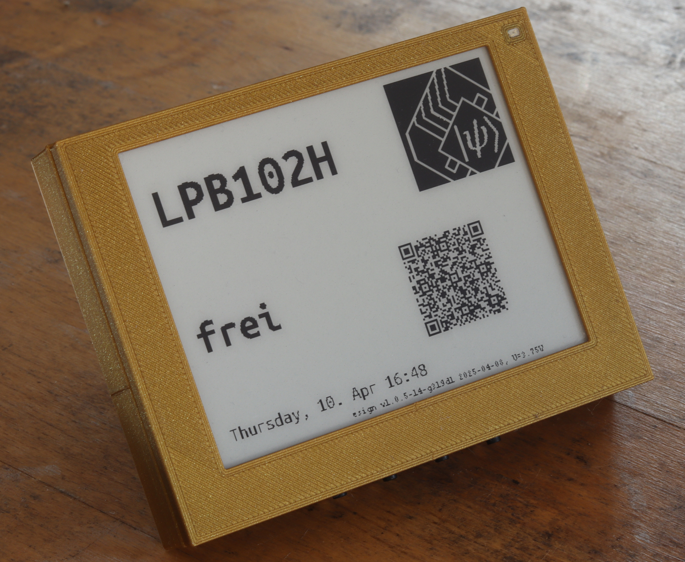
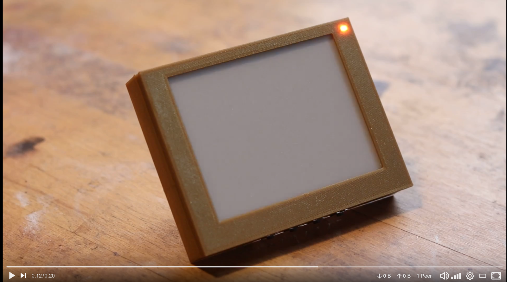
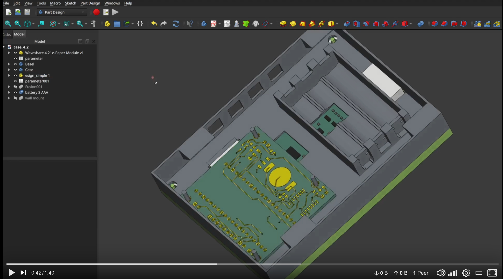

# esign
**eSign** is a battery-powered, energy-efficient system for ePaper-based display of information gathered via Wi-Fi, used for room signage, for example as a display front-end for the [SeatSurfing](https://github.com/seatsurfing/seatsurfing) desk sharing system. It features RTC-based power control allowing for low power consumption, the project includes 3D-printed case, and a custom PCB.


<p align="center">
  <a href="images/esign_4_2_1_cropped.jpg" target="_blank">
    
  </a>
</p>

<p align="center">
  <i>Fully assembled 4.2&quot; eSign with ePaper display and 3D-printed enclosure.</i>
<i>Click the image to view full-resolution version.</i>
</p>

<p align="center">
  <a href="https://makertube.net/w/gxEmY74gfjZvuuTyGfTvus" target="_blank">
    
  </a>
</p>

<p align="center">
  <i>eSign 4.2" operating: realtime clock switching on the device (LED on), pico connects to WIFI and gathered current booking of desk (originally, desk was free), epaper is refreshed with the new information, device is switching off (LED off).</i>
<i>Click the image to view video.</i>
</p>

---

## Features

- **ePaper Display Support**
  Compatible with Waveshare 7.5" V2 and 4.2" V2 displays.

- **Energy Efficiency**
  Hardware-controlled shutdown and wake-up via RTC and MOSFET switching — no software sleep required, operated by standard AA or AAA batteries and optional coin cell. About 10.000 iteration for large version (7.5", 3 x AA batteries) and about 5.000 iteration for small version (4.2", 3 X AAA batteries). 

<p align="center">
  <a href="images/log_prototype_esign_7_5.png" target="_blank">
    
  </a>
</p>

<p align="center">
  <i>Log of the AA battery voltage of prototype of the 7.5" version, running since 172 days, refreshing every 1800 seconds. </i>
<i>Click the image to view full-resolution version.</i>
</p>

- **Wi-Fi Connectivity**
  Periodically fetches content via HTTP, refresh time freely programmable.

- **Multi-Page Display**
  Up to 8 user-selectable display pages via pushbuttons.

- **Battery Voltage Monitoring**
  + Monitoring of AA / AAA batteries via adc and logged via Wi-Fi, hardware-controlled voltage divider activated only when needed for RTC supply.

- **For room signage application: Room Customization**
  Layouts and display content can be adjusted for room types (office, conference, seminar).

---

## Project Overview

This repository provides all design files, documentation, and code for the open hardware and firmware project *eSign*:

1. **3D-Printed Enclosure**
   Files and documentation for the modular eSign enclosure.
<p align="center">
  <a href="https://makertube.net/w/ogwhv2iz3bCEpDWk6XRxvr" target="_blank">
    
  </a>
</p>

<p align="center"><i>Click to watch the 3D enclosure demo video on MakerTube</i></p>

2. **Electronics**
   Custom PCB design with RTC, Pico W, and power management for ultra-low energy consumption.

3. **Firmware**
   C-based firmware for RTC wakeup, Wi-Fi sync, ePaper display handling, and modular room configuration.
---

## 📁 Repository Structure

```
esign/
├── LICENSE                    # Top-level: explains dual-licensing
├── hardware/                 # Schematics, pcb, 3D printable case
│   ├── LICENSE               # CERN-OHL-S v2.0
│	 ├── enclosure/            # 3D printable STL files and documentation
│	 ├── pcb/                  # KiCAD files
│   └── ...
├── firmware/                 # C firmware source, headers, build system
│   ├── LICENSE               # Apache 2.0
│   └── ...
├── docs/                    # Markdown docs, tips, and background
├── images/                  # Photos, renderings, examples
└── README.md                # This file
```

---

## 📜 License

This project contains both hardware and software components, which are licensed under separate terms:

- All content in the **/hardware** directory is licensed under the **CERN Open Hardware License v2 - Strongly Reciprocal (CERN-OHL-S-2.0)**.
- All content in the **/firmware** directory is licensed under the **Apache License, Version 2.0**.

See the LICENSE files in the respective directories for full license texts and terms.

---

## 🚧 Status

🟢 **Active development** — repository being built step-by-step.

Want to follow or contribute? Star the repo, and stay tuned for updates!

## 📬 Contact

For questions, feedback, or contributions, feel free to reach out via email:

✉️ [c0de@posteo.de](mailto:c0de@posteo.de)

