# inki (esign) 

**inki** is a bare-metal, battery-powered, energy-efficient system for ePaper-based display of information gathered via Wi-Fi, used for example for room signage and as front-end for the [SeatSurfing](https://github.com/seatsurfing/seatsurfing) desk sharing system via seatsurfing's Rest API. It features a webinterface for setup, a realtime clock-based power control for battery-powered, low-power consumption and wireless operation, an 3D-printed case, a custom PCB and an ePaper display that retains its content even when powered off. 
<!--  -->

<p align="center">
  <a href="images/esign_4_2_1_cropped.jpg" target="_blank">
    
  </a>
</p>

<p align="center">
  <i>Fully assembled 4.2&quot; inki (powered-off) with ePaper display and 3D-printed enclosure.</i>
<!--<i>Click the image to view full-resolution version.</i>-->
</p>

<p align="center">
  <a href="https://makertube.net/w/gxEmY74gfjZvuuTyGfTvus" target="_blank">
    
  </a>
</p>

<p align="center">
  <i>inki 4.2" operating: realtime clock switching on the device (LED on), pico connects to WIFI and gatheres current booking of desk (originally, desk is free), epaper is refreshes with the new information, device is switching off (LED off).</i>
<!-- <i>Click the image to view video.</i> -->
</p>

---

## Quick Start: How to Use inki

inki can be configured and updated via the Wi-Fi setup mode:

- Start and connect to the inki Wi-Fi hotspot "inki-setup", open your browser and go to http://192.168.4.1.

- Setup the configuration of the device (settings will be stored for future use)

  - Wi-Fi credentials
  - Seatsurfing settings (copy&paste from seatsurfing "service account": credentials, location id, space id, ...)
  - Device settings (room numbers, seats per room, automatic refresh intervals...)
  - Optionally upload a custom logo / piktogram
  - Optionally upload firmware updates, inki will automatically choose the most recent version at next reboot
  - Set realtime clock, using the client's time (your phone/tablet/computer used for connecting to inki)
  - inki reboots and starts displaying live information from the configured source (e.g., seatsurfing server).

No cables, programmer or flashing required — just insert batteries and use your browser.

For more options and logo uploads, see [See “Configuration via Web Interface”](#configuration-via-web-interface)

<p align="center">
  <a href="images/inki_webinterface_landingpage_combined.png" target="_blank">
    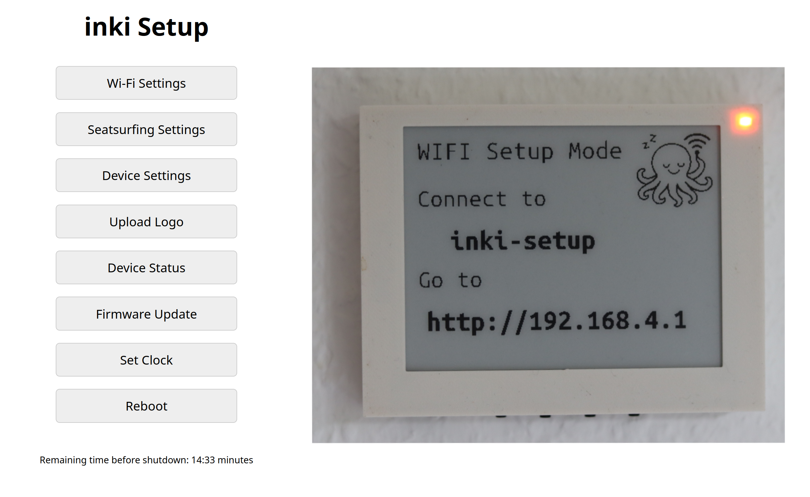
  </a>
</p>

<p align="center">
  <em>Left: browser-based configuration interface at <code>http://192.168.4.1</code>. Right: inki Wi-Fi setup mode.</em>
</p>

## Features

- **Battery powered**
  No cables needed

- **Web Interface**
  For setup, configuration and updates via WIFI, bootloader (https://github.com/c0de111/pico_bootloader) automatically chooses most recent firmware version
  
- **ePaper Display Support**
  Compatible with Waveshare 7.5" V2 and 4.2" V2 displays, retains its content even when powered off.

- **Automatically synchronizes with the seats booked via seatsurfing**
  Shows current booking state and name, layouts, refresh time and display content can be adjusted for room types (office, conference, seminar).

- **Wi-Fi Connectivity**
  Periodically fetches content via HTTP, refresh time freely programmable.

- **Multi-Page Display**
  Up to 8 user-selectable display pages via pushbuttons. [See „User-selectable pages“](#user-selectable-pages)

- **Battery Voltage Monitoring**
  + Monitoring of AA / AAA batteries via adc and logged via Wi-Fi, hardware-controlled voltage divider activated only when needed for RTC supply.

- - **Energy Efficiency**
  Hardware-controlled shutdown and wake-up via RTC and MOSFET switching — no software sleep required, operated by standard AA or AAA batteries. About 10.000 iteration for large version (7.5", 3 x AA batteries) and about 5.000 iteration for small version (4.2", 3 X AAA batteries). Runtime (depending on wake-up frequency and thus iterations) up to years. For estimation use the script [power_consumption_estimate.py](hardware/circuit/)
  
<p align="center">
  <a href="images/log_prototype_esign_7_5.png" target="_blank">
    
  </a>
  <a href="images/esign_4_2_backside.JPG" target="_blank">
    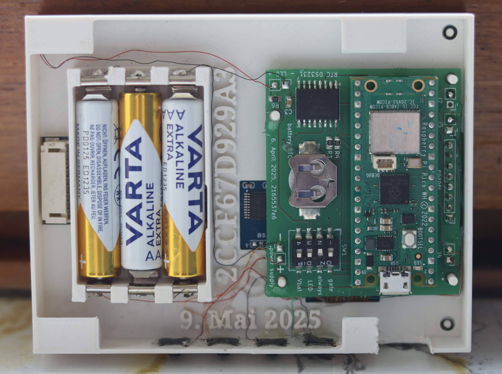
  </a>
</p>

<p align="center">
  <i>Left: Log of the AA battery voltage of a 7.5&quot; prototype, running for 198 days with 1800-second refresh intervals.<br>
  Right: The 4.2&quot; version of the eSign device with its backside visible (including batteries and RTC).<br>
  Click any image to view the full-resolution version.</i>
</p>

---

## Build your own *inki*

This repository provides all design files, documentation, and code to build your own *inki*:

1. **3D-Printed Enclosure**
   Files and documentation for the modular enclosure - [(STLs and FreeCAD files)](hardware/enclosure/).
   
   ### Assembly Animation (4.2" version)

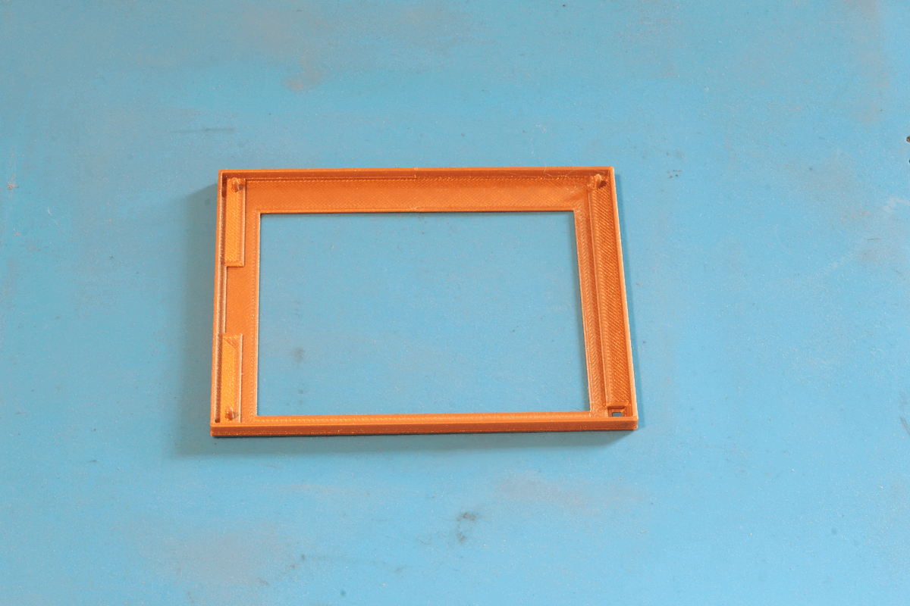

This animation shows the step-by-step assembly of the 4.2" enclosure.

2. **Electronics**
   Custom PCB design with RTC, Pico W, and power management for ultra-low energy consumption [(schematics, pcbs, docs)](hardware/circuit/).

3. **Firmware**
   C-based firmware for RTC wakeup, Wi-Fi sync, Web interface, ePaper display handling, and modular room configuration [(C code, build instructions, docs)](firmware).

   <p align="center">
  <a href="https://makertube.net/w/ogwhv2iz3bCEpDWk6XRxvr" target="_blank">
    
  </a>
</p>

<p align="center"><i>Click to watch the 3D enclosure demo video on MakerTube</i></p>

   ---

## User-selectable pages

Eight user-definable pages can be selected during startup by holding combinations of buttons 1–3 and pressing *Start*.

> **Page selection logic:**  
> The active page number is determined by summing the values of the pressed buttons:  
> **Button 1 = 1**, **Button 2 = 2**, **Button 3 = 4**  
> This allows selecting pages 1–7. Page 0 is the default.  
> For details, see the **“How to Show Pages”** screen (Page 4 below).

---

### Page 0: **Room Occupation (Default View)**  
Displays current room occupancy fetched from the seatsurfing server. The room name, occupant, and space number are shown. This page is shown automatically triggered by the Real Time Clock.

<p align="center">
  <a href="images/4_2_white_pages/esign_4_2_page_0.JPG" target="_blank">
    
  </a>
</p>

---

### Page 1: **Do Not Disturb**  
Indicates that the room should not be entered. No network connection required.

<p align="center">
  <a href="images/4_2_white_pages/esign_4_2_page_1.JPG" target="_blank">
    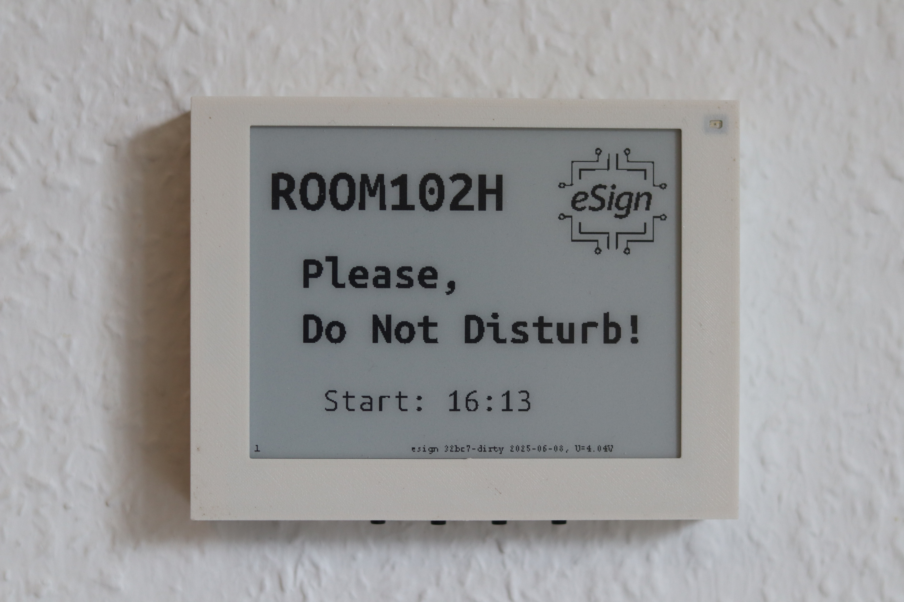
  </a>
</p>

---

### Page 2: **Universal Decision Maker**  
A playful feature for indecisive moments. Randomly displays either “Yes!” or “No!” without requiring a network connection.


<p align="center">
  <a href="images/4_2_white_pages/esign_4_2_page_2_YES.JPG" target="_blank">
    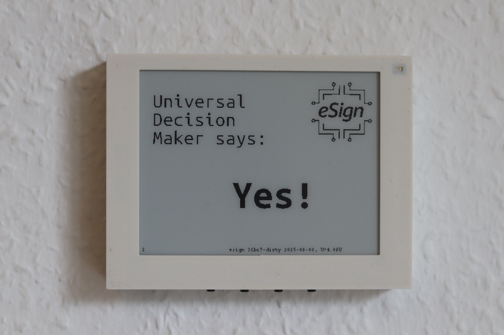
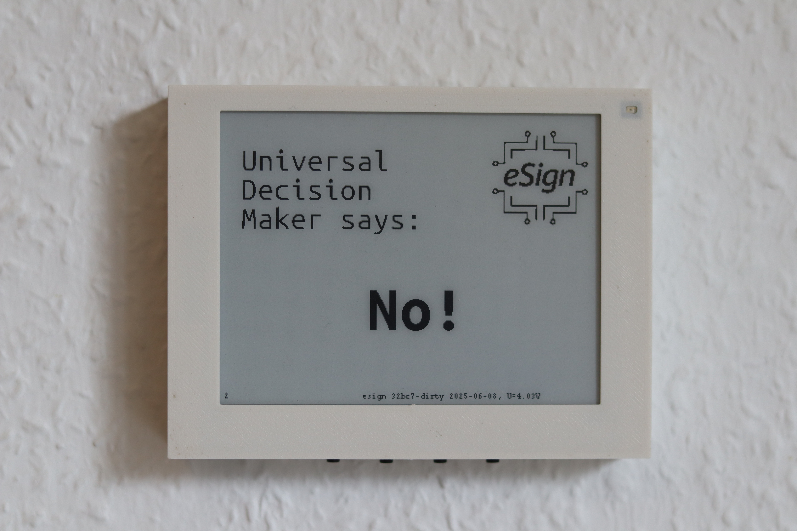
  </a>
</p>


<p align="center">
  <a href="https://makertube.net/w/1DiDJP2MitTqSbMxgx9UBE" target="_blank">
    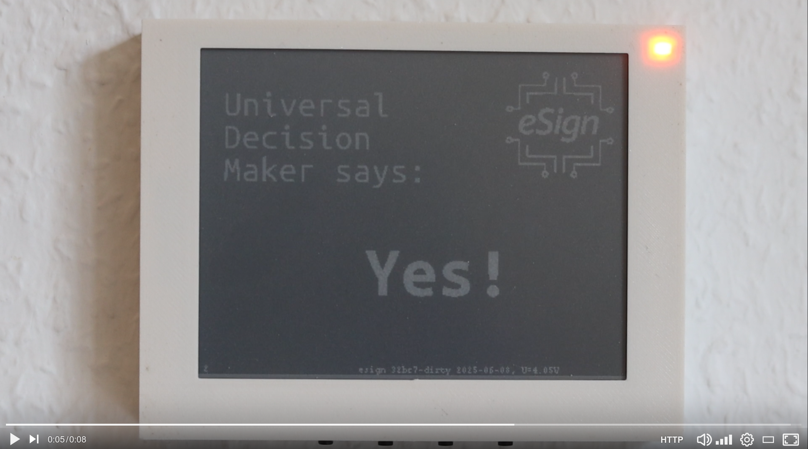
  </a>

  <a href="https://makertube.net/w/9YwdxqEVp6JRVWCDHPg3zx" target="_blank">
    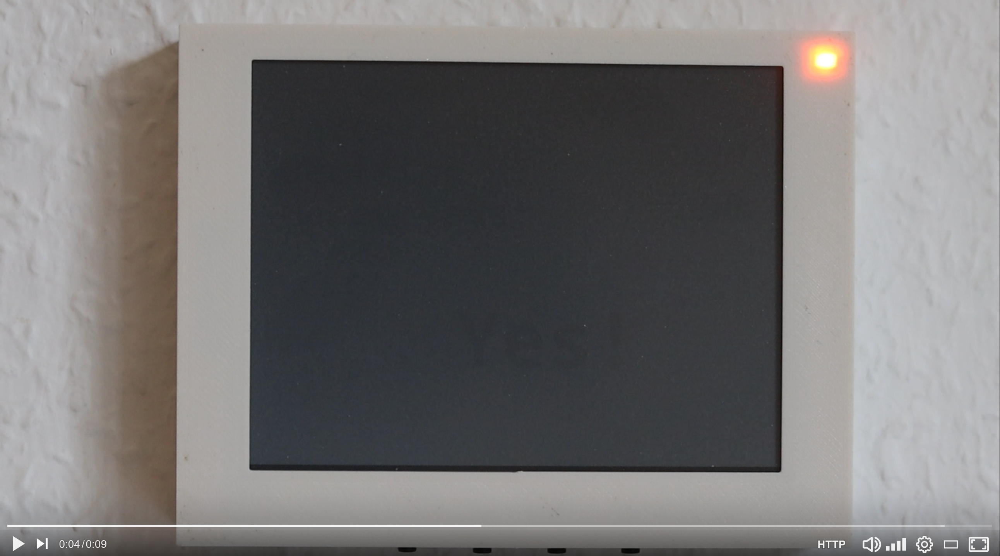
  </a>
</p>

---

### Page 3: **Display Settings**  
Shows technical details such as Wi-Fi settings, update intervals, battery voltage (Vcc and Vbat), raw and DST-corrected RTC time, MAC address, and ADC scaling constant.

<p align="center">
  <a href="images/4_2_white_pages/esign_4_2_page_3.JPG" target="_blank">
    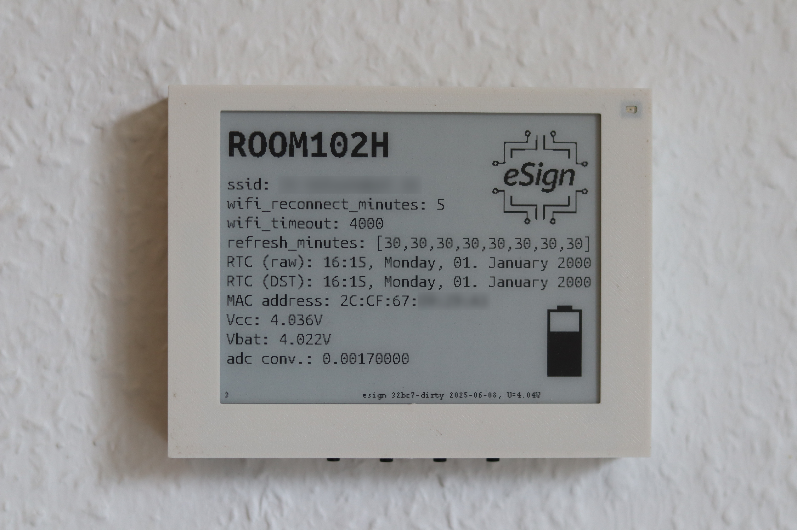
  </a>
</p>

---

### Page 4: **How to Show Pages**  
Explains the startup page selection mechanism using button combinations.  
Useful as an on-device quick reference.

<p align="center">
  <a href="images/4_2_white_pages/esign_4_2_page_4.JPG" target="_blank">
    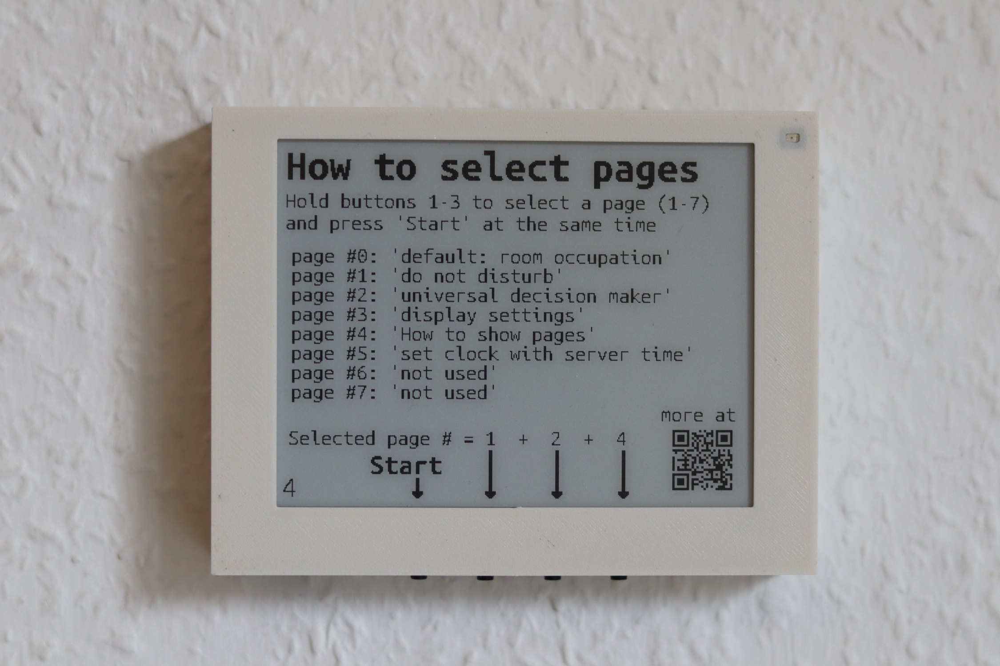
  </a>
</p>

---

### Page 5: *(Currently unused)*  
Reserved for future features. 
<!--<p align="center">
  <a href="images/4_2_white_pages/esign_4_2_page_5.JPG" target="_blank">
    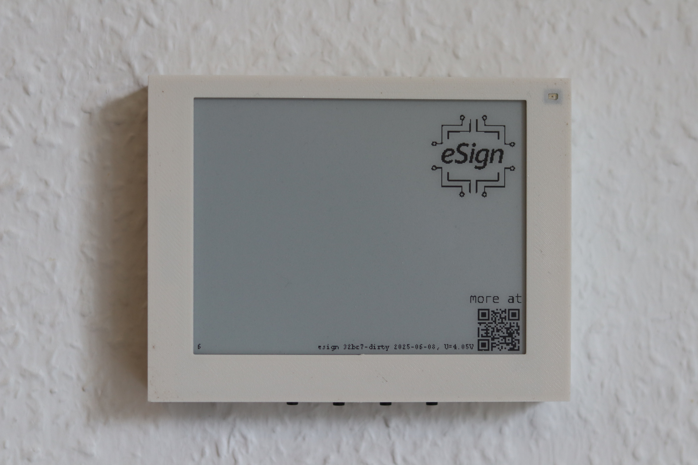
  </a>
</p>-->

---

### Page 6–7: *(Currently unused)*  
Reserved for future features. 

## Configuration via Web Interface

Should be self-explanatory.

## Repository Structure

```
esign/
├── LICENSE                    # Top-level: explains dual-licensing
├── hardware/                 # Schematics, pcb, 3D printable case
│   ├── LICENSE               # CERN-OHL-S v2.0
│	 ├── enclosure/            # 3D printable STL files and documentation
│	 ├── circuit/              # KiCAD files and documentation
│   └── ...
├── firmware/                 # C firmware source, headers, build system
│   ├── LICENSE               # Apache 2.0
│   └── ...
├── docs/                    # Markdown docs, tips, and background
├── images/                  # Photos, renderings, examples
└── README.md                # This file
```

---

## License

This project contains both hardware and software components, which are licensed under separate terms:

- All content in the **/hardware** directory is licensed under the **CERN Open Hardware License v2 - Strongly Reciprocal (CERN-OHL-S-2.0)**.
- All content in the **/firmware** directory is licensed under the **Apache License, Version 2.0**.

See the LICENSE files in the respective directories for full license texts and terms.

---

## Status

**Active development** — repository being built step-by-step.

Want to follow or contribute? Star the repo, and stay tuned for updates!

## Contact

For questions, feedback, or contributions, feel free to reach out via email:

✉️ [c0de@posteo.de](mailto:c0de@posteo.de)

