# inki

**inki** is a bare-metal, battery-powered, energy-efficient system for ePaper-based display of information gathered via Wi-Fi with a runtime up to years. This repository includes two use cases: room signage as front-end for the [SeatSurfing](https://github.com/seatsurfing/seatsurfing) desk sharing system and display of live information from home automation with homematic and [ccu-historian](https://github.com/mdzio/ccu-historian). It features a webinterface for setup, a realtime clock-based power control for battery-powered, low-power consumption and wireless operation, an 3D-printed case with dovetail mount, a custom PCB and an ePaper display that retains its content when powered off. See also https://hackaday.io/project/203726-inki-low-power-wireless-epaper-device
<!--  -->

  <a href="images/esign_4_2_1_cropped.jpg" target="_blank">
    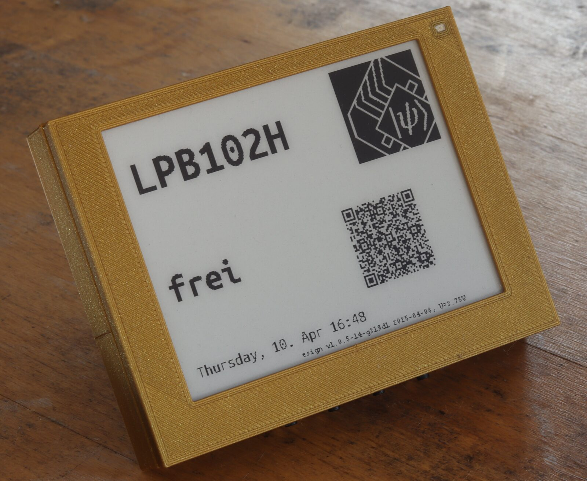
  </a>

  <i>Fully assembled 4.2&quot; inki (powered-off) with ePaper display and 3D-printed enclosure.</i>
<!--<i>Click the image to view full-resolution version.</i>-->

  <a href="https://makertube.net/w/gxEmY74gfjZvuuTyGfTvus" target="_blank">
    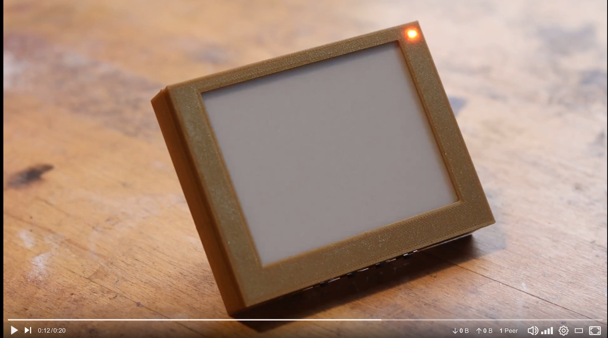
  </a>

  <i>inki 4.2" operating: realtime clock switching on the device (LED on), pico connects to WIFI and gatheres current booking of desk (originally, desk is free), epaper is refreshes with the new information, device is switching off (LED off).</i>
<!-- <i>Click the image to view video.</i> -->

  <a href="images/7_5_ccu-historian.JPG" target="_blank">
    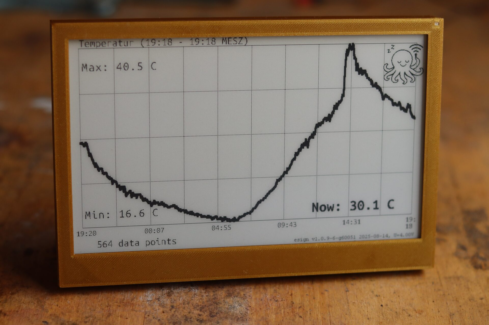
  </a>

  <i>7.5" version displaying temperature reading of a sensor from the ccu-historian home automation system over the last 24 hours.
</i>
<!-- <i>Click the image to view video.</i> -->

---

## Try it: How to Use inki
If you have a Pico W at hand, you can quickly test:

- Download a prebuilt UF2 from the latest Release:
  - Historian: [inki_historian.uf2](https://github.com/c0de111/inki/releases/latest/download/inki_historian.uf2)
  - SeatSurfing: [inki_seatsurfing.uf2](https://github.com/c0de111/inki/releases/latest/download/inki_seatsurfing.uf2)
  - Homematic: [inki_homematic.uf2](https://github.com/c0de111/inki/releases/latest/download/inki_homematic.uf2)
- Hold BOOTSEL while plugging in the Pico W → the RPI-RP2 drive appears
- Copy the UF2 to the drive → the board reboots automatically
- The Pico W onboard LED blinks “inki” in Morse
- Connect to the Wi‑Fi AP `inki-setup`, then open `http://192.168.4.1` in your browser
- Works on a bare Pico W (EPAPER_NONE by default)

---

## Quick Start: How to Use inki

inki can be configured and updated with a new firmware via the Wi-Fi setup mode:

- Start and connect to the inki Wi-Fi hotspot "inki-setup", open your browser and go to http://192.168.4.1.

- Setup the configuration of the device

  - Wi-Fi credentials
  - Seatsurfing settings, via seatsurfing's Rest API, (copy&paste from seatsurfing "service account": credentials, location id, space id, room name, ...)
  - Optionally adjust device settings (automatic refresh intervals...)
  - Optionally upload a custom logo / piktogram
  - Optionally upload firmware updates, inki will automatically choose the most recent version at next reboot
  - Set realtime clock, using the client's time (your phone/tablet/computer used for connecting to inki)
  - inki reboots and starts displaying live information from the configured source

No cables, programmer or flashing required — just insert batteries and use your browser.

  <a href="images/inki_webinterface_landingpage_combined.png" target="_blank">
    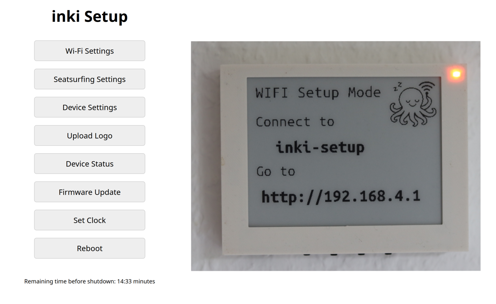
  </a>

  <em>Left: browser-based configuration interface at <code>http://192.168.4.1</code>. Right: inki Wi-Fi setup mode.</em>

## Features

- **Battery powered**
  No cables needed, runtime up to years

- **Web Interface**
  For setup, configuration and updates via WIFI, bootloader (https://github.com/c0de111/pico_bootloader) automatically chooses most recent firmware version

- **ePaper Display Support**
  Compatible with Waveshare 7.5" V2 and 4.2" V2 displays, retains its content even when powered off.

- **Automatically synchronizes with: seats booked via seatsurfing, data from ccu-historian**
  Shows current booking state and name, layouts, refresh time and display content can be adjusted for room types, or data from ccu-historian or a homematic ccu.

- **Wi-Fi Connectivity**
  Periodically fetches content via HTTP, refresh time freely programmable.

- **Multi-Page Display**
  User-selectable display pages via pushbuttons. [See „User-selectable pages“](#user-selectable-pages)

- **Battery Voltage Monitoring** Monitoring of AA / AAA batteries via adc and logged via Wi-Fi, hardware-controlled voltage divider activated only when needed for RTC supply.

- **Telemetry** Optional [inki-monitor](inki-monitor/) companion service for battery, Wi-Fi, and temperature monitoring with browser-rendered charts.

- **Energy Efficiency** Hardware-controlled shutdown and wake-up via RTC and MOSFET switching — no software sleep required, operated by standard AA or AAA batteries. About 10.000 iteration for large version (7.5", 3 x AA batteries) and about 5.000 iteration for small version (4.2", 3 X AAA batteries). Runtime (depending on wake-up frequency and thus iterations) up to years. For estimation use the script [power_consumption_estimate.py](hardware/circuit/)

  <a href="images/log_prototype_esign_7_5.png" target="_blank">
    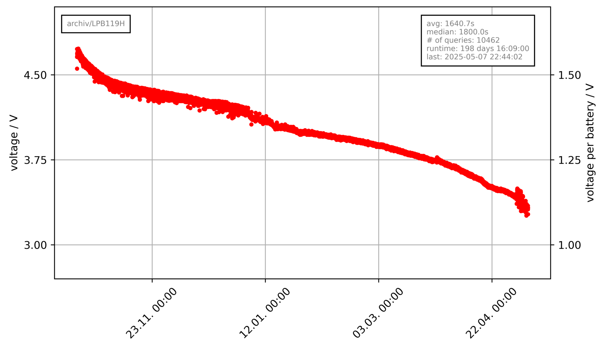
  </a>
  <a href="images/esign_4_2_backside.JPG" target="_blank">
    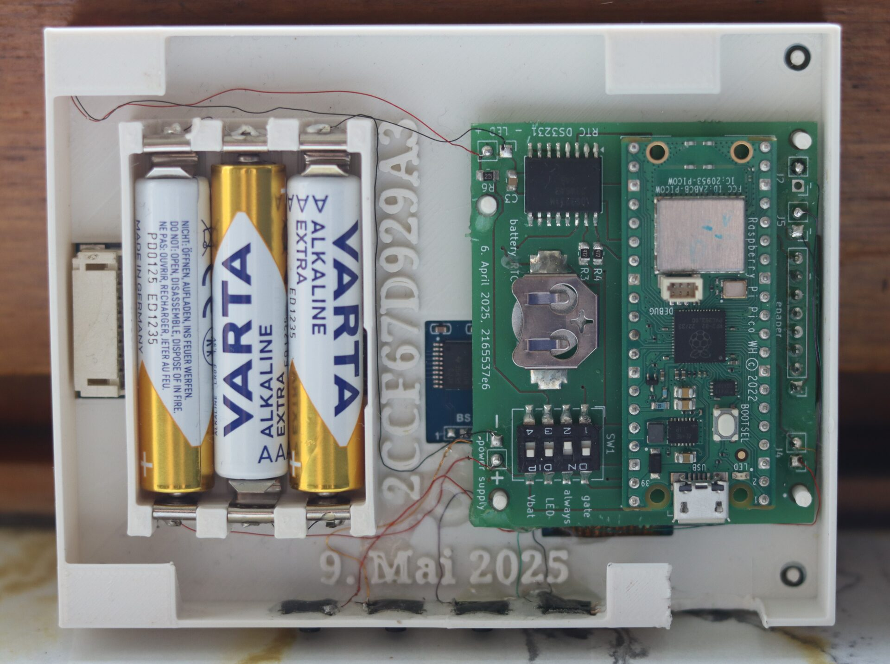
  </a>

  <i>Left: Log of the AA battery voltage of a 7.5&quot; prototype, running for 198 days with 1800-second refresh intervals. 
  Right: The 4.2&quot; version of the inki device with its backside visible (including batteries and RTC). 
  Click any image to view the full-resolution version.</i>

---

## Build your own *inki*

This repository provides all files, documentation, and code to build your own *inki*:

1. **3D-Printed Enclosure**
   Files and documentation for the modular enclosure with a dovetail mount - [(STLs and FreeCAD files)](hardware/enclosure/).

   ### Assembly Animation (4.2" version)

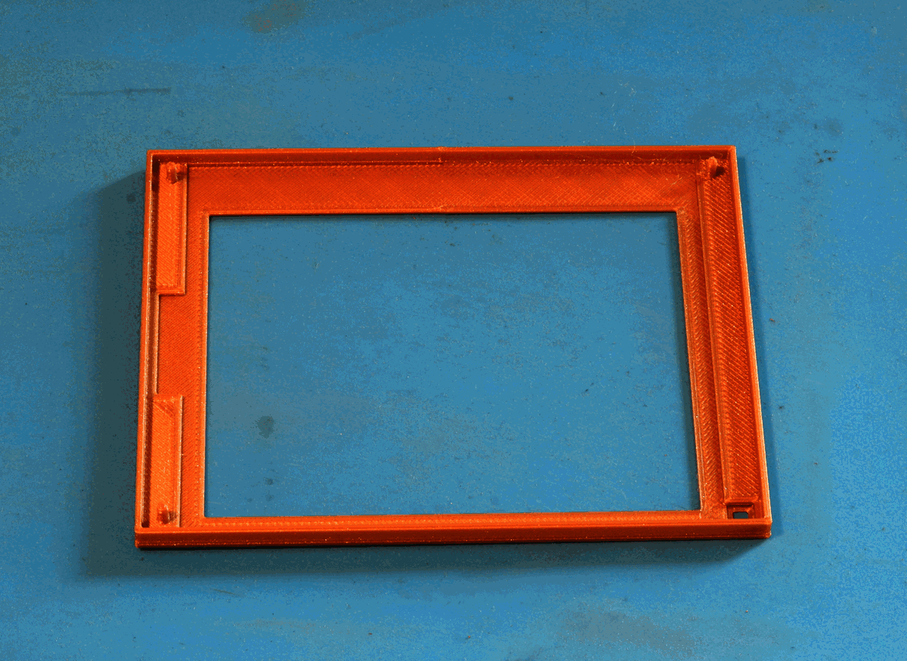

This animation shows the step-by-step assembly of the 4.2" enclosure.

2. **Electronics**
   Custom PCB design with RTC, Pico W, and power management for ultra-low energy consumption [(schematics, pcbs, docs)](hardware/circuit/) — [schematic PDF](hardware/circuit/inki_l2.pdf).

3. **Firmware**
   C-based firmware for RTC wakeup, Wi-Fi sync, Web interface, ePaper display handling, and modular room configuration [(C code, build instructions, docs)](firmware).

   

  <a href="https://makertube.net/w/ogwhv2iz3bCEpDWk6XRxvr" target="_blank">
    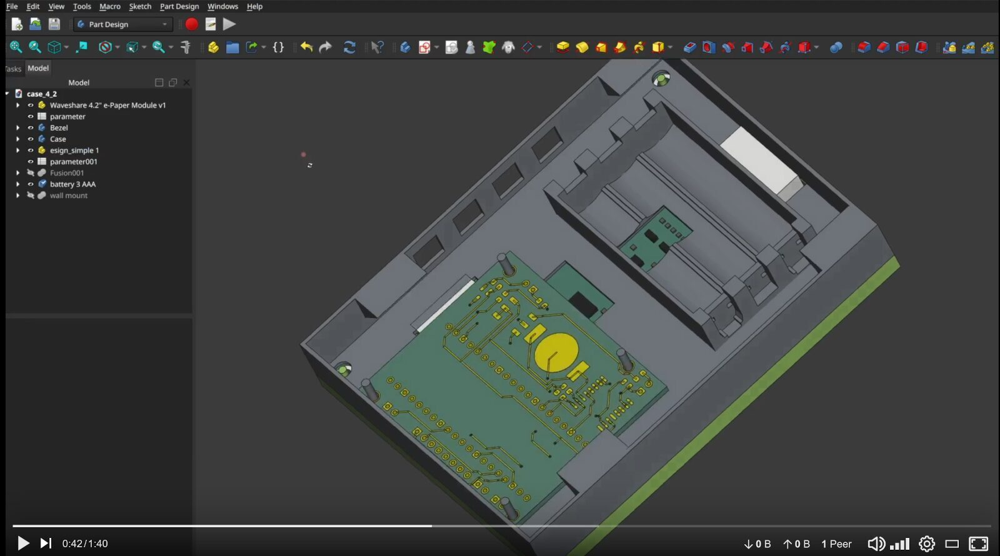
  </a>

<i>Click to watch the 3D enclosure demo video on MakerTube</i>

   ---

## User-selectable pages

Eight combinations are available by holding buttons 1–3 while pressing *Start*. New hardware diode-ORs the buttons so **any button wakes the device**; older boards still only wake on Button 1, but page selection works the same once awake.

> **Page selection logic:**
> Active page = sum of pressed buttons: **Button 1 = 1**, **Button 2 = 2**, **Button 3 = 4**
> Pages 0–3 are primary; pages 4–7 mirror 0–3 (legacy combos).

---

### Page 1: **Room Occupation (Default View)**
Displays current room occupancy fetched from the seatsurfing server. The room name, occupant, and space number are shown. This page is shown automatically triggered by the Real Time Clock.

  <a href="images/4_2_white_pages/esign_4_2_page_0.JPG" target="_blank">
    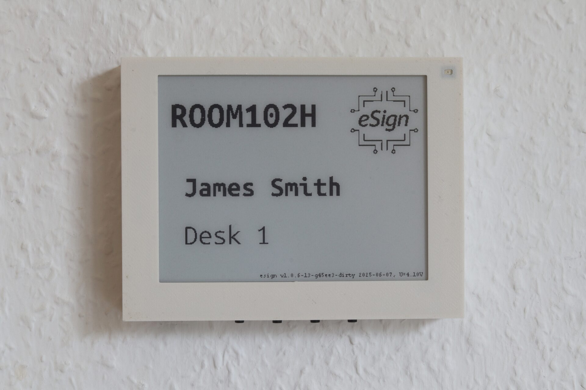
  </a>

---

### Page 2: **Videokonferenz**
Static “videoconference in progress” view. No network connection required.

  <a href="images/4_2_white_pages/esign_4_2_page_1.JPG" target="_blank">
    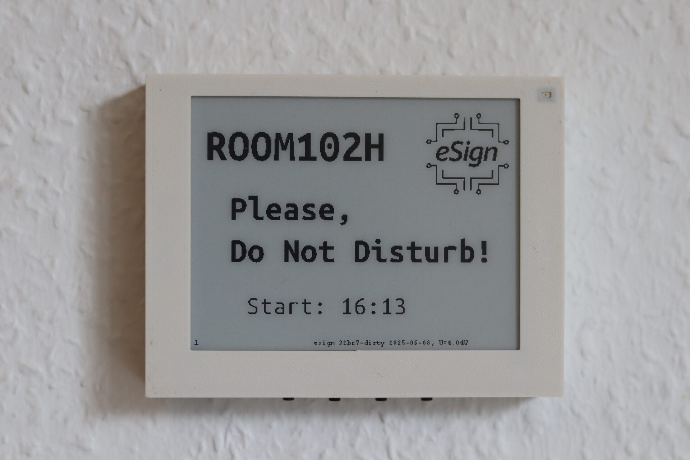
  </a>

---

### Page 3: **Universal Decision Maker**
A playful feature for indecisive moments. Randomly displays either “Yes!” or “No!” without requiring a network connection.

  <a href="images/4_2_white_pages/esign_4_2_page_2_YES.JPG" target="_blank">
    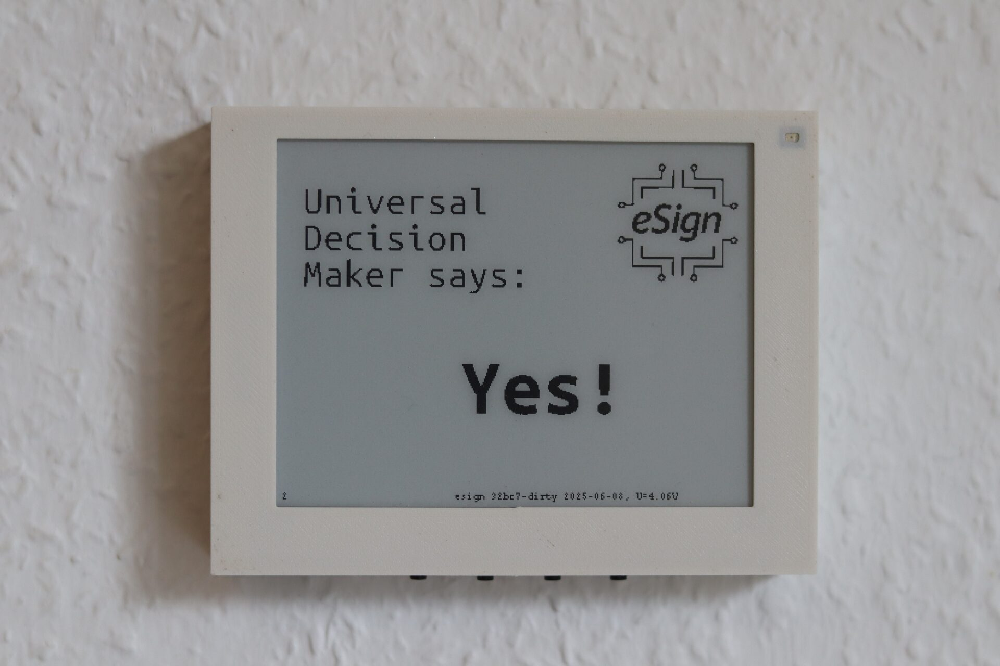
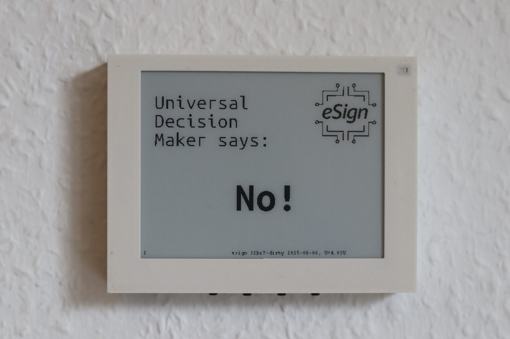
  </a>

  <a href="https://makertube.net/w/1DiDJP2MitTqSbMxgx9UBE" target="_blank">
    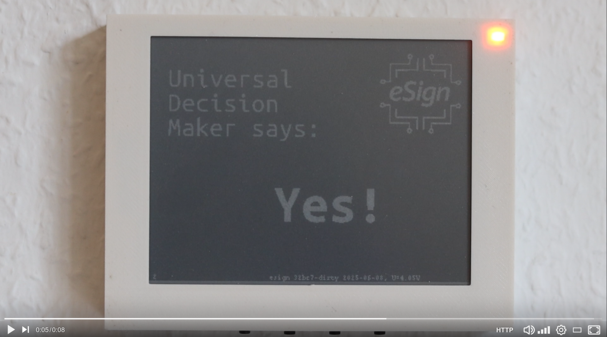
  </a>

  <a href="https://makertube.net/w/9YwdxqEVp6JRVWCDHPg3zx" target="_blank">
    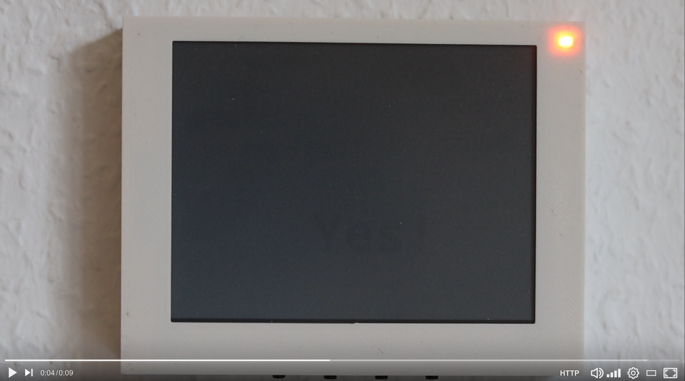
  </a>

---

### Page 4: **Web Interface Info**
Shows Wi-Fi setup info so you can connect to the device’s web UI.

  

---

## License

This project contains both hardware and software components, which are licensed under separate terms:

- All content in the **/hardware** directory is licensed under the **CERN Open Hardware License v2 - Strongly Reciprocal (CERN-OHL-S-2.0)**.
- All content in the **/firmware** directory is licensed under the **Apache License, Version 2.0**.

See the LICENSE files in the respective directories for full license texts and terms.

---

## Status

**Active development** — repository being built step-by-step.

Want to follow or contribute? Star the repo, and stay tuned for updates!

## Contact

For questions, feedback, or contributions, feel free to reach out via email:

✉️ [c0de@posteo.de](mailto:c0de@posteo.de)
