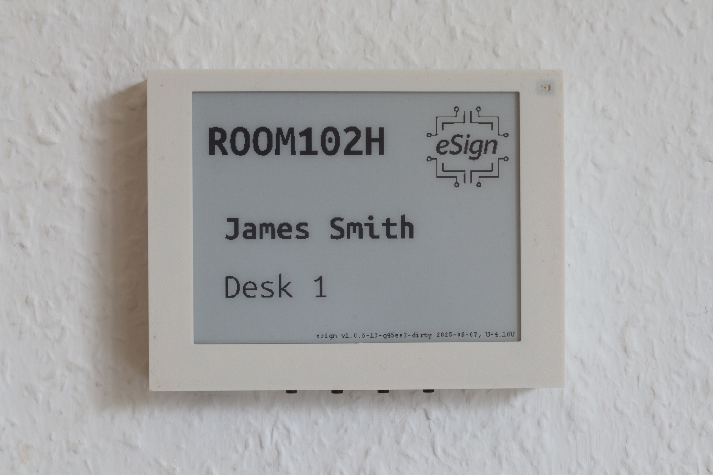

# esign
**eSign** is a battery-powered, energy-efficient system for ePaper-based display of information gathered via Wi-Fi, used for room signage, for example as a display front-end for the [SeatSurfing](https://github.com/seatsurfing/seatsurfing) desk sharing system via seatsurfing's Rest API. It features RTC-based power control allowing for low power consumption, the project includes an 3D-printed case, a custom PCB and an epaper display.


<p align="center">
  <a href="images/esign_4_2_1_cropped.jpg" target="_blank">
    
  </a>
</p>

<p align="center">
  <i>Fully assembled 4.2&quot; eSign with ePaper display and 3D-printed enclosure.</i>
<i>Click the image to view full-resolution version.</i>
</p>

<p align="center">
  <a href="https://makertube.net/w/gxEmY74gfjZvuuTyGfTvus" target="_blank">
    
  </a>
</p>

<p align="center">
  <i>eSign 4.2" operating: realtime clock switching on the device (LED on), pico connects to WIFI and gatheres current booking of desk (originally, desk is free), epaper is refreshes with the new information, device is switching off (LED off).</i>
<i>Click the image to view video.</i>
</p>

---

## Features

- **ePaper Display Support**
  Compatible with Waveshare 7.5" V2 and 4.2" V2 displays.

- **Automatically synchronizes with the seats booked via seatsurfing**
  Shows current booking state and name, layouts and display content can be adjusted for room types (office, conference, seminar).

- **Wi-Fi Connectivity**
  Periodically fetches content via HTTP, refresh time freely programmable.

- **Multi-Page Display**
  Up to 8 user-selectable display pages via pushbuttons. [See „User-selectable pages“](#user-selectable-pages)

- **Battery Voltage Monitoring**
  + Monitoring of AA / AAA batteries via adc and logged via Wi-Fi, hardware-controlled voltage divider activated only when needed for RTC supply.

- - **Energy Efficiency**
  Hardware-controlled shutdown and wake-up via RTC and MOSFET switching — no software sleep required, operated by standard AA or AAA batteries. About 10.000 iteration for large version (7.5", 3 x AA batteries) and about 5.000 iteration for small version (4.2", 3 X AAA batteries). Runtime (depending on wake-up frequency and thus iterations) up to years. For estimation use the script [power_consumption_estimate.py](hardware/circuit/)

<p align="center">
  <a href="images/log_prototype_esign_7_5.png" target="_blank">
    
  </a>
</p>

<p align="center">
  <i>Log of the AA battery voltage of prototype of the 7.5" version, running for 198 days, refreshing every 1800 seconds each day of the week. Longer runtimes can be achieved with less frequent updates.  </i>
<i>Click the image to view full-resolution version.</i>
</p>


---

## Build your own *eSign*

This repository provides all design files, documentation, and code to build your own *eSign*:

1. **3D-Printed Enclosure**
   Files and documentation for the modular eSign enclosure - [(STLs and FreeCAD files)](hardware/enclosure/).
<p align="center">
  <a href="https://makertube.net/w/ogwhv2iz3bCEpDWk6XRxvr" target="_blank">
    
  </a>
</p>

<p align="center"><i>Click to watch the 3D enclosure demo video on MakerTube</i></p>

2. **Electronics**
   Custom PCB design with RTC, Pico W, and power management for ultra-low energy consumption [(schematics, pcbs, docs)](hardware/circuit/).

3. **Firmware**
   C-based firmware for RTC wakeup, Wi-Fi sync, ePaper display handling, and modular room configuration [(C code, build instructions, docs)](firmware).
---

## User-selectable pages

Eight user-definable pages can be selected during startup by holding combinations of buttons 1–3 and pressing *Start*.

> 💡 **Page selection logic:**  
> The active page number is determined by summing the values of the pressed buttons:  
> **Button 1 = 1**, **Button 2 = 2**, **Button 3 = 4**  
> This allows selecting pages 1–7. Page 0 is the default.  
> For details, see the **“How to Show Pages”** screen (Page 4 below).

---

### Page 0: **Room Occupation (Default View)**  
Displays current room occupancy fetched from the seatsurfing server. The room name, occupant, and space number are shown. This page is shown automatically triggered by the Real Time Clock.

<p align="center">
  <a href="images/4_2_white_pages/esign_4_2_page_0.JPG" target="_blank">
    
  </a>
</p>

---

### Page 1: **Do Not Disturb**  
Indicates that the room should not be entered. No network connection required.

<p align="center">
  <a href="images/4_2_white_pages/esign_4_2_page_1.JPG" target="_blank">
    
  </a>
</p>

---

### Page 2: **Universal Decision Maker**  
A playful feature for indecisive moments. Randomly displays either “Yes!” or “No!” without requiring a network connection.


<p align="center">
  <a href="images/4_2_white_pages/esign_4_2_page_2_YES.JPG" target="_blank">
    

  </a>
</p>


---

### Page 3: **Display Settings**  
Shows technical details such as Wi-Fi settings, update intervals, battery voltage (Vcc and Vbat), raw and DST-corrected RTC time, MAC address, and ADC scaling constant.

<p align="center">
  <a href="images/4_2_white_pages/esign_4_2_page_3.JPG" target="_blank">
    
  </a>
</p>

---

### Page 4: **How to Show Pages**  
Explains the startup page selection mechanism using button combinations.  
Useful as an on-device quick reference.

<p align="center">
  <a href="images/4_2_white_pages/esign_4_2_page_4.JPG" target="_blank">
    
  </a>
</p>

---

### Page 5: **Set Clock with Server Time**  
[Not yet implemented in the seatsurfing version] Synchronizes the internal RTC with the current time from a remote time server. Especially useful after battery replacement or when the RTC has been reset. 

---

### Page 6–7: *(Currently unused)*  
Reserved for future features. 
<p align="center">
  <a href="images/4_2_white_pages/esign_4_2_page_5.JPG" target="_blank">
    
  </a>
</p>


## 📁 Repository Structure

```
esign/
├── LICENSE                    # Top-level: explains dual-licensing
├── hardware/                 # Schematics, pcb, 3D printable case
│   ├── LICENSE               # CERN-OHL-S v2.0
│	 ├── enclosure/            # 3D printable STL files and documentation
│	 ├── circuit/              # KiCAD files and documentation
│   └── ...
├── firmware/                 # C firmware source, headers, build system
│   ├── LICENSE               # Apache 2.0
│   └── ...
├── docs/                    # Markdown docs, tips, and background
├── images/                  # Photos, renderings, examples
└── README.md                # This file
```

---

## 📜 License

This project contains both hardware and software components, which are licensed under separate terms:

- All content in the **/hardware** directory is licensed under the **CERN Open Hardware License v2 - Strongly Reciprocal (CERN-OHL-S-2.0)**.
- All content in the **/firmware** directory is licensed under the **Apache License, Version 2.0**.

See the LICENSE files in the respective directories for full license texts and terms.

---

## 🚧 Status

🟢 **Active development** — repository being built step-by-step.

Want to follow or contribute? Star the repo, and stay tuned for updates!

## 📬 Contact

For questions, feedback, or contributions, feel free to reach out via email:

✉️ [c0de@posteo.de](mailto:c0de@posteo.de)

