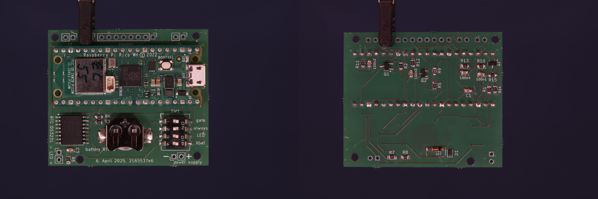
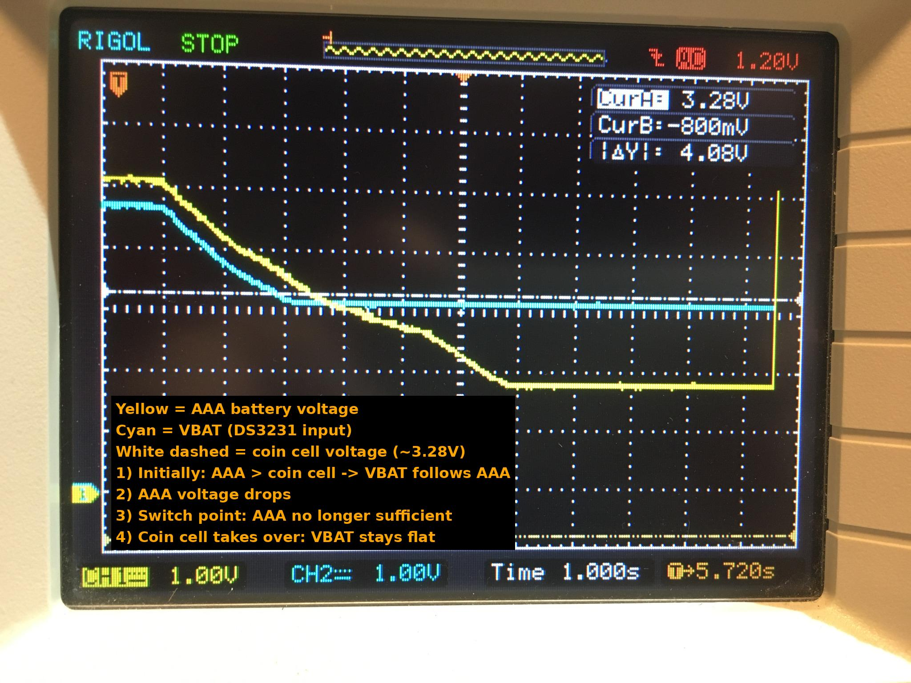

# eSign Circuit

This repository contains the electronic schematic and hardware documentation for the **eSign** project — a battery-powered, low-power circuit employing  a Raspberry Pi Pico W and a DS3231 RTC module for wireless ePaper display - as for instance for room signage.

---

## Overview
The eSign circuit is designed for long-term operation (years) using 3×AAA or 3×AA batteries. It uses a DS3231 real-time clock for accurate timekeeping and wake-up scheduling, combined with MOSFET-based power switching to fully disconnect the controller to minimize power consumption between wake cycles. During wake cycles information is fetched via WIFI and displayed on an epaper which retains its display without power consumption.

---

## Concept, Functional Blocks and Components

In the default state of the circuit, **Q1** is in the off-state and the Pico does not get any supply voltage. Two events can switch **Q1** on via its gate and thus power the Pico: An alarm from the RTC **DS3231** via its INT pin, or a manual trigger via **pushbutton #0**. If this happens, the Pico will start, and as a first action in its program pull down the gate from **Q2**, so that power is maintained even if the push button is released by the user. The Pico will then execute its programme and always finish the programme with setting the next alarm in the **DS3231**, and, subsequently, finally cutting itself off power by switching **Q1** off. This leaves the Pico completely unpowered and the circuit back to the default state. In the default state, the circuits draws a **few µA** only, compared to **several mA** in the usual sleep modes of the Pico. During the wake cycle, the current drawn is approximately 50 mA for about 15 seconds. The epaper is controlled via SPI, the DS3231 via I2C.

Manual user interaction via:
 
- **SW1 / DIP switch**: Allow static configuration.
	-  **"gate"**: **pushbutton #0** can be connected to gate for manual triggering 
	- **"always on"**: gate of **Q1** can be permanently grounded (powering Vsys of the Pico with Vcc) for debugging
	- **"LED"**: activate status LED, signaling running Pico
	- **"Vbat"**: Connect DS3231 Vbat to Vcc via **D2** (see below)

- **Pushbuttons** (**J2**, **J4**, **J5**): 
	- **pushbutton #0** / **J2**: the same line as INT# and used for manual wake-up. 
	- **pushbutton #1-3**: for manual user input, debounced by 1k resistors and 100nF caps, read once at start-up by the Pico -> First push **pushbutton #1-3**, only after that start Pico by **pushbutton #0**

---

## Power Consumption and Estimations

The typical battery life under realistic usage conditions can be estimated by power_consumption_estimate.py, example output for 4.2" esign:

### Power Consumption Estimate for 4.2"

**Used Parameters**

- **Idle current**: 5 µA (RTC consumption, residual current via pullups and others)  
- **Activation consumption**: 0.250 mAh per wake-up (same for 4.2″ and 7.5″ versions, measured)  
- **LED consumption** (included above): 0.021 mAh per wake-up  
- **Wake-up schedule**: 7× per day, 5 days per week  
- **Battery self-discharge**: 2.5 % per year  
- **Battery capacity**: 1200 mAh (AAA batteries)  

**Annualized Consumption Rates (approximate)**

- **Idle**: 43.8 mAh/year  
- **Active (wake-ups)**: 456.2 mAh/year  

**⇒ Estimated battery lifetime: 850 days (≈ 2.33 years)**

**Yearly Breakdown**

| Year | Self-Discharge (mAh) | Fixed Consumption (mAh) |
|------|----------------------|--------------------------|
| 1    | 23.43                | 500.55                   |
| 2    | 10.50                | 500.55                   |
| 3    | 0.68                 | 164.90                   |

This is based on measurements and gives estimations useful to gauge wake-up energy relative to idle current in order to optimize runtime versus refresh cycle.

---
### Power Consumption Estimate for 7.5"

**Used Parameters**

- **Idle current**: 5 µA (RTC consumption, residual current via pullups and others)  
- **Activation consumption**: 0.250 mAh per wake-up (same for 4.2″ and 7.5″ versions, measured)  
- **LED consumption** (included above): 0.021 mAh per wake-up  
- **Wake-up schedule**: 48× per day, 7 days per week  
- **Battery self-discharge**: 2.5 % per year  
- **Battery capacity**: 2500 mAh (AA batteries)  

**Annualized Consumption Rates (approximate)**

- **Idle**: 43.8 mAh/year  
- **Active (wake-ups)**: 4380 mAh/year  

**⇒ Estimated battery lifetime: 205 days (≈ 0.56 years)**

**Yearly Breakdown**

| Year | Self-Discharge (mAh) | Fixed Consumption (mAh) |
|------|----------------------|--------------------------|
| 1    | 17.58                | 2484.6                   |

This chart shows the measured energy consumption of the 7.5" prototype. 

This is based on measurements and gives estimations useful to gauge wake-up energy relative to idle current in order to optimize runtime versus refresh cycle.

---

## Diode circuit for Vbat Supply for the DS3231

The goal of this circuit (**D1** and **D2**) is to supply the DS3231 real-time clock module with power at all times—either from the main power source (e.g. 3×AA(A) batteries) or, if unavailable, from a coin cell (e.g. CR1225). The switch between sources is passive, using one diode per supply path, and aims to minimize energy loss and especially protect the coin cell from unnecessary drain.

---

### Functional Principle

The two power sources (AAA and coin cell) are each connected to the VBAT pin through a diode. The diode with the higher input voltage (minus its forward voltage drop) determines which source supplies VBAT. The other diode remains reverse-biased and blocks current.

The intention is for the coin cell to only take over once the main battery voltage is no longer sufficient—ideally right before the microcontroller stops functioning due to low voltage. The DS3231 operates correctly on VBAT voltages between 2.3 V and 6.0 V, with 3.0 V being typical for coin-cell powered backup operation.

---

### D1 = 1N4148 (standard silicon diode), D2 = BAT54 (Schottky)

| Source      | Diode   | Forward Voltage (Vf) | Notes                                        |
|-------------|---------|----------------------|-----------------------------------------------|
| AAA         | 1N4148  | ~0.7 V               | Higher voltage drop, prioritizes AAA clearly |
| Coin cell   | BAT54   | ~0.2–0.3 V           | Low drop, ideal for backup                   |

#### Advantages
- **Clear prioritization**: Coin cell only activates when AAA voltage drops below ~3.8 V.
- **Coin cell is protected** for most of the battery life.
- **Simple component selection**, widely available parts.

#### Disadvantages
- At low AAA voltages (e.g. <3.3 V), VBAT may drop below 2.6 V.
- The 1N4148 causes a non-negligible drop in VBAT during AAA operation.

#### Measurement confirming the switch behavior

An oscilloscope measurement verifies the expected behavior:

Initially (high AAA voltage), VBAT closely follows the AAA level. As the AAA voltage drops and the output of the 1N4148 falls below the coin cell’s level minus the BAT54 drop, the coin cell takes over. VBAT then stabilizes around 3.1 V and becomes independent of AAA voltage. The transition is smooth, without instability.

---

### Self-Adjusting Coin Cell Protection

As the coin cell slowly discharges over time, its output voltage decreases (e.g. from 3.3 V to 2.8 V). This naturally delays its takeover, further prioritizing the AAA battery as long as possible. This behavior provides passive and automatic coin cell protection without requiring additional logic.

#### Reverse Leakage Behavior During Passive Source Switching

During normal operation, when one source (AAA or coin cell) supplies VBAT, the unused source’s diode is reverse-biased. This raises the question of whether significant leakage current could flow back into the inactive battery, potentially causing unnecessary drain over time.

At typical room temperatures (25 °C), the expected reverse leakage currents are extremely low:

| Diode         | Typical Reverse Current @ 25 °C, ~4 V | Notes |
|---------------|----------------------------------------|-------|
| 1N4148WS      | ~1–10 nA                              | Negligible |
| BAT54 (Schottky) | ~10–100 nA                          | Higher than silicon but still negligible |

Even under worst-case assumptions (maximum datasheet values at 20–25 V reverse voltage), the leakage remains in the nanoampere range. In real-world operation at ~3–4 V reverse voltage, the leakage current is orders of magnitude smaller than the typical standby current of the DS3231 RTC itself (1.5–2.0 µA).

Thus, no practical impact on battery life is expected from reverse leakage through either diode path. The diodes reliably block the inactive source without measurable drain, maintaining the energy-saving properties of the design.

---
## A few notes about some of the components

- **Q1**: TSM260P02CX, P-channel MOSFET — disconnects the Pico W from the battery supply during sleep. Controlled via DS3231 and push button #0. 
- **D1**: BAT54 Schottky diode — supplies power from the battery pack to the circuit and DS3231 VCC.
- **D2**: BAT54 Schottky diode — connects the optional coin cell to DS3231 VBAT for backup operation.
- **R1–R3**: Gate resistors for Q1 — control gate behavior during transitions, including pull-up (R2) and pull-down (R3).
- **INT#/Button**: Wake-up signal sourced from either the DS3231 alarm output or a manual pushbutton connected in parallel. The gate of Q1 is pulled low through these paths, enabling the Pico's power.
- **R7, R8**: Voltage divider for measuring the 3×AAA battery voltage. Divider is only active when **Q1** is conducting (i.e., during Pico operation).
- **U2**: DS3231SN — provides accurate timekeeping, I²C communication, and a programmable alarm interrupt controlling the whole circuit.
- **J4**: Coin cell holder — supplies VBAT to DS3231 when main power is lost.
- The DS3231 remains powered at all times to maintain time and alarm functionality.
- **Q3**: IRLML6344 N-channel MOSFET — enables a separate divider (**R1** and **R14**) to measure the voltage of the RTC coin cell (Vbat). Controlled via GP14.
- **R15**: Pull-down on Q3 gate — ensures that Q3 remains off when unpowered to eliminate leakage current.
- **GP14**: GPIO enabling VBAT divider (Q3).
- **GP27**: Analog input (ADC) for measuring voltage from the divider.

## Files and Folders

- `esign.kicad_sch`: Main schematic
- `esign.kicad_pcb`: PCB layout
- `power_consumption_estimate.py`: Lifetime and energy analysis script
- `datasheets_and_manuals/`: Component datasheets
- `Fotos_Circuit/`: Documentation images

---

## License

This hardware is published under the **CERN-OHL-S v2** license. See `LICENSE.md` for details.
