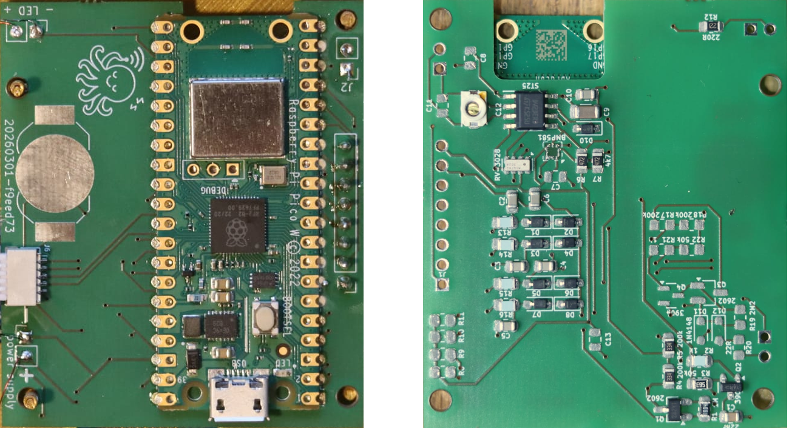
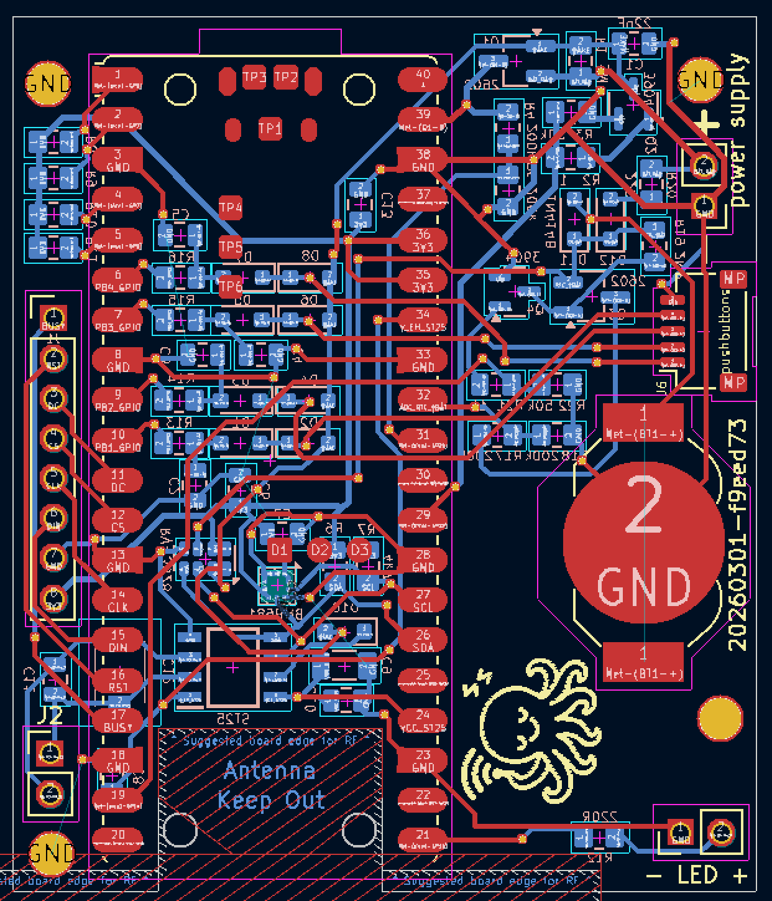
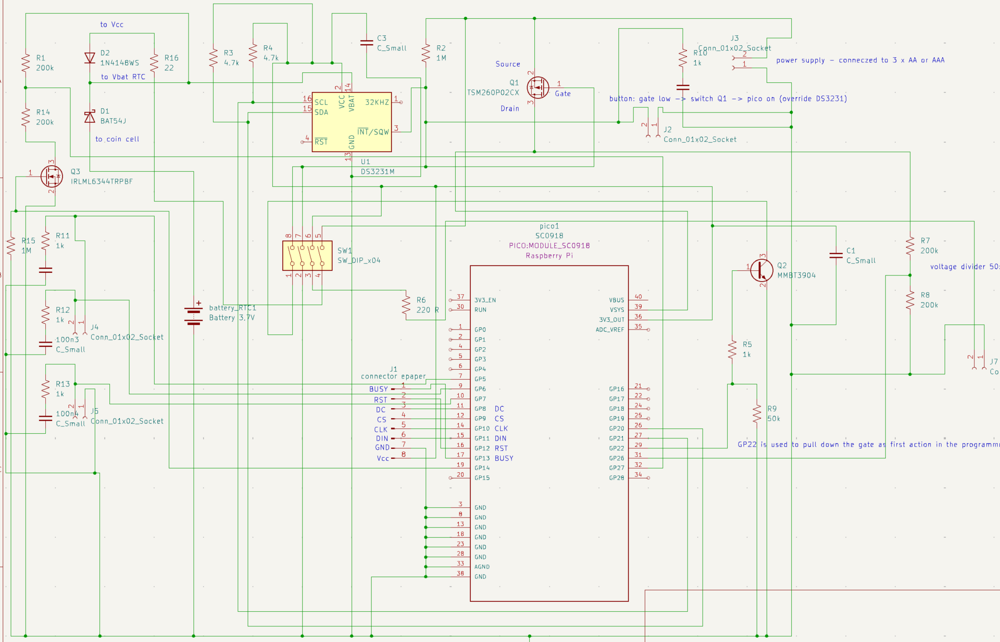
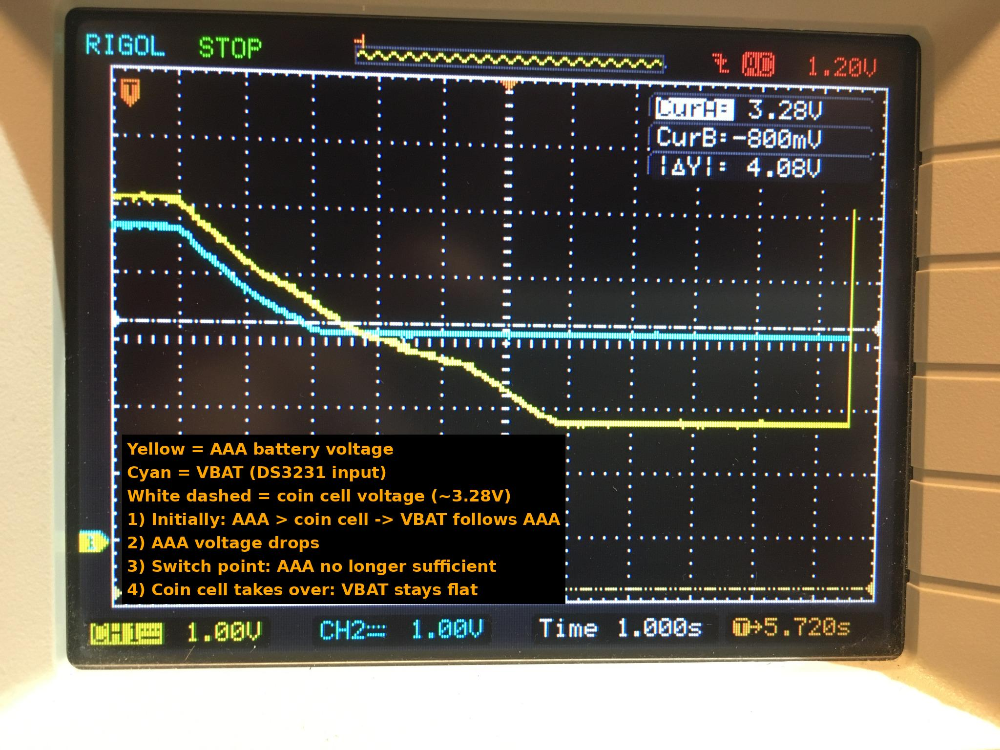

# inki Circuit

This directory contains the schematic and hardware documentation for the **inki** PCB. There is also a former hand-solderable design, see [`legacy/`](legacy/).

---

## Overview

The inki circuit is designed for long-term operation (years) using 3×AAA or 3×AA
batteries. It uses a real-time clock for accurate timekeeping and wake-up scheduling —
either a DS3231 or RV-3028, detected automatically at runtime — combined with
MOSFET-based power switching to fully disconnect the controller between wake cycles.
During wake cycles, information is fetched via Wi-Fi and displayed on an ePaper display
that retains its content without power.

Key features:
- **MOSFET power switching** — Pico W fully disconnected during sleep, drawing only µA from the RTC and passives
- **Dual RTC support** — DS3231 or RV-3028, auto-detected at runtime via I2C
- **NFC wake and control** — ST25 chip powered by RF field when Pico is off
- **Board identity straps** — 4-bit hardware profile (GP0–GP3) selects display type and hardware variant at boot
- **push button inputs** — for manual user-controlled pages and fetches
- **Coin cell backup** — optional diode-OR circuit keeps RTC powered when main batteries are depleted

---

## Concept, Functional Blocks and Components

The power control concept works as follows: in the default (sleep) state **Q1** is off
and the Pico W has no supply voltage. Three sources can wake the system: an RTC alarm
(DS3231 or RV-3028 via their INT pin), a manual trigger via **pushbutton #0**, or an NFC
field event from the ST25DV. Once Q1 switches on, the Pico pulls down the gate of **Q2**
to hold power, executes its program, sets the next RTC alarm, and cuts power by releasing
Q1 — returning to the µA idle state.

The ePaper display is controlled via SPI; RTC and NFC communicate via I2C.

Manual user interaction:
- **Pushbutton #0**: manual wake-up (parallel to RTC INT)
- **Pushbuttons #1–3**: user input, read once at startup — press before powering on
- **ST25 NFC**: write an NFC message to the tag to trigger a wake or page selection

<table>
<tr>
  <td style="padding: 20px;"></td>
  <td style="padding: 20px;"></td>
</tr>
<tr>
  <td align="center" style="padding: 20px;"><em>inki board – for details use KiCAD</em></td>
  <td align="center" style="padding: 20px;"><em>schematic – <a href="inki_l2.pdf">PDF</a> · for details use KiCAD</em></td>
</tr>
</table>

---

## Board Identity Straps (R8–R11)

Four 10k pull-up resistors on GP0–GP3 encode the board profile as a 4-bit code read at
boot to determine display type and hardware configuration.

- **Populated resistor** = bit reads `1`
- **Empty pad** = bit reads `0` (firmware applies internal pull-down)

| Code | R8  | R9  | R10 | R11 | Display | Coin Cell | Board                     |
|------|-----|-----|-----|-----|---------|-----------|---------------------------|
| 0x00 | —   | —   | —   | —   | ?       | yes       | Legacy / unstrapped       |
| 0x01 | 10k | —   | —   | —   | 7.5"    | yes       | L1, 7.5"                  |
| 0x02 | —   | 10k | —   | —   | 4.2"    | yes       | L1, 4.2"                  |
| 0x03 | 10k | 10k | —   | —   | 7.5"    | yes       | L2, 7.5"                  |
| 0x04 | —   | —   | 10k | —   | 4.2"    | yes       | L2, 4.2"                  |
| 0x05 | 10k | —   | 10k | —   | 7.5"    | no        | L2 minimal (no coin cell) |
| 0x06 | —   | 10k | 10k | —   | 4.2"    | no        | L2 minimal 4.2" (no coin cell) |
| 0x07–0x0F | — | — | — | — | —      | —         | (reserved)                |

I2C devices (RTC, NFC) are auto-detected via bus scan — not encoded in straps. Buttons
and LED do not require strap encoding.

---

## RTC Backend Selection

The firmware auto-detects the RTC at runtime via I2C bus scan:
- **DS3231** at 0x68 — classic, high-accuracy, moderate power (~200 µA active)
- **RV-3028** at 0x52 — ultra-low power (~45 nA idle), AMBA/Micro Crystal

Both provide alarm-based wake scheduling. The RV-3028 improves idle power budget
significantly for high-frequency refresh use cases.

---

## NFC Integration (ST25DV04KC)

The ST25DV NFC tag is powered from the RF field when the Pico is off (0 mA from battery).
Its GPIO-controlled VCC line (GP18) is held low during sleep. An NFC write from a phone
or reader pulls the ST25 INT line, which feeds into the wake circuit — waking the device
without a button press. The firmware reads the NFC payload at startup to determine the
requested page or action.

---

## Power Consumption and Estimations

The typical battery life under realistic usage conditions can be estimated by power_consumption_estimate.py, example output for 4.2" esign:

### Power Consumption Estimate for 4.2"

**Used Parameters**

- **Idle current**: 5 µA (RTC consumption, residual current via pullups and others)
- **Activation consumption**: 0.250 mAh per wake-up (same for 4.2″ and 7.5″ versions, measured)
- **LED consumption** (included above): 0.021 mAh per wake-up
- **Wake-up schedule**: 7× per day, 5 days per week
- **Battery self-discharge**: 2.5 % per year
- **Battery capacity**: 1200 mAh (AAA batteries)

**Annualized Consumption Rates (approximate)**

- **Idle**: 43.8 mAh/year
- **Active (wake-ups)**: 456.2 mAh/year

**⇒ Estimated battery lifetime: 850 days (≈ 2.33 years)**

**Yearly Breakdown**

| Year | Self-Discharge (mAh) | Fixed Consumption (mAh) |
|------|----------------------|--------------------------|
| 1    | 23.43                | 500.55                   |
| 2    | 10.50                | 500.55                   |
| 3    | 0.68                 | 164.90                   |

This is based on measurements and gives estimations useful to gauge wake-up energy relative to idle current in order to optimize runtime versus refresh cycle.

---

### Power Consumption Estimate for 7.5"

**Used Parameters**

- **Idle current**: 5 µA (RTC consumption, residual current via pullups and others)
- **Activation consumption**: 0.250 mAh per wake-up (same for 4.2″ and 7.5″ versions, measured)
- **LED consumption** (included above): 0.021 mAh per wake-up
- **Wake-up schedule**: 48× per day, 7 days per week
- **Battery self-discharge**: 2.5 % per year
- **Battery capacity**: 2500 mAh (AA batteries)

**Annualized Consumption Rates (approximate)**

- **Idle**: 43.8 mAh/year
- **Active (wake-ups)**: 4380 mAh/year

**⇒ Estimated battery lifetime: 205 days (≈ 0.56 years)**

**Yearly Breakdown**

| Year | Self-Discharge (mAh) | Fixed Consumption (mAh) |
|------|----------------------|--------------------------|
| 1    | 17.58                | 2484.6                   |

This chart shows the measured energy consumption of the 7.5" prototype.

This is based on measurements and gives estimations useful to gauge wake-up energy relative to idle current in order to optimize runtime versus refresh cycle.

---

## Diode circuit for Vbat Supply for the RTC

The coin cell is optional: inki auto-syncs the RTC from the server at each wake cycle, so the RTC only needs to hold time between wake cycles. Where fitted, the goal of this circuit (**D1** and **D2**) is to supply the RTC with power at all times — either from the main power source (e.g. 3×AA(A) batteries) or, if unavailable, from a coin cell (e.g. CR1225). The switch between sources is passive, using one diode per supply path, and aims to minimize energy loss and especially protect the coin cell from unnecessary drain.

---

### Functional Principle

The two power sources (AAA and coin cell) are each connected to the VBAT pin through a diode. The diode with the higher input voltage (minus its forward voltage drop) determines which source supplies VBAT. The other diode remains reverse-biased and blocks current.

The intention is for the coin cell to only take over once the main battery voltage is no longer sufficient — ideally right before the microcontroller stops functioning due to low voltage. The DS3231 and RV-3028 both operate correctly on VBAT voltages down to 1.5–2.0 V.

---

### D1 = 1N4148 (standard silicon diode), D2 = BAT54 (Schottky)

| Source      | Diode   | Forward Voltage (Vf) | Notes                                         |
|-------------|---------|----------------------|-----------------------------------------------|
| AAA         | 1N4148  | ~0.7 V               | Higher voltage drop, prioritizes AAA clearly  |
| Coin cell   | BAT54   | ~0.2–0.3 V           | Low drop, ideal for backup                    |

#### Advantages
- **Clear prioritization**: Coin cell only activates when AAA voltage drops below ~3.8 V.
- **Coin cell is protected** for most of the battery life.
- **Simple component selection**, widely available parts.

#### Disadvantages
- At low AAA voltages (e.g. <3.3 V), VBAT may drop below 2.6 V.
- The 1N4148 causes a non-negligible drop in VBAT during AAA operation.

#### Measurement confirming the switch behavior

An oscilloscope measurement verifies the expected behavior:

Initially (high AAA voltage), VBAT closely follows the AAA level. As the AAA voltage drops and the output of the 1N4148 falls below the coin cell's level minus the BAT54 drop, the coin cell takes over. VBAT then stabilizes around 3.1 V and becomes independent of AAA voltage.

---

### Self-Adjusting Coin Cell Protection

As the coin cell slowly discharges over time, its output voltage decreases (e.g. from 3.3 V to 2.8 V). This naturally delays its takeover, further prioritizing the AAA battery as long as possible. This behavior provides passive and automatic coin cell protection without requiring additional logic.

#### Reverse Leakage Behavior During Passive Source Switching

At typical room temperatures (25 °C), the expected reverse leakage currents are extremely low:

| Diode            | Typical Reverse Current @ 25 °C, ~4 V | Notes                              |
|------------------|----------------------------------------|------------------------------------|
| 1N4148WS         | ~1–10 nA                               | Negligible                         |
| BAT54 (Schottky) | ~10–100 nA                             | Higher than silicon but negligible |

In real-world operation at ~3–4 V reverse voltage, the leakage is orders of magnitude smaller than the typical standby current of the RTC itself. No practical impact on battery life is expected.

---

## Key Components

- **Q1**: P-channel MOSFET — main power switch, disconnects Pico during sleep
- **Q2**: N-channel MOSFET — power latch (Pico holds itself on)
- **U1**: Raspberry Pi Pico W — main controller (Wi-Fi, ePaper, I2C, SPI)
- **U2**: DS3231SN or RV-3028 — RTC, alarm wake, I2C (auto-detected)
- **U3**: ST25DV04KC — NFC tag, ISO 15693, I2C, RF-powered when Pico off
- **D1/D2**: Diode-OR for RTC Vbat (main battery + coin cell backup)
- **R8–R11**: Board identity straps (10k pull-ups on GP0–GP3)
- **BT1**: Coin cell (RTC backup, e.g. CR1225)

---

## Files

- `inki_l2.pdf` — schematic PDF (no KiCad required)
- `inki_l2.kicad_sch` — main schematic
- `inki_l2.kicad_pcb` — PCB layout
- `inki_l2_BOM.csv` — bill of materials
- `wake_sources.kicad_sch` — wake circuit sub-schematic
- `optional_i2c_device.kicad_sch` — optional I2C device sub-schematic
- `project-libraries/` — custom KiCad symbols and footprints

---

## Legacy Design

A former hand-solderable design is preserved in [`legacy/`](legacy/). It supports DS3231
only and has no NFC or identity straps, but can be assembled by an experienced solderer
without SMD equipment.

---

## License

This hardware is published under the **CERN-OHL-S v2** license.
