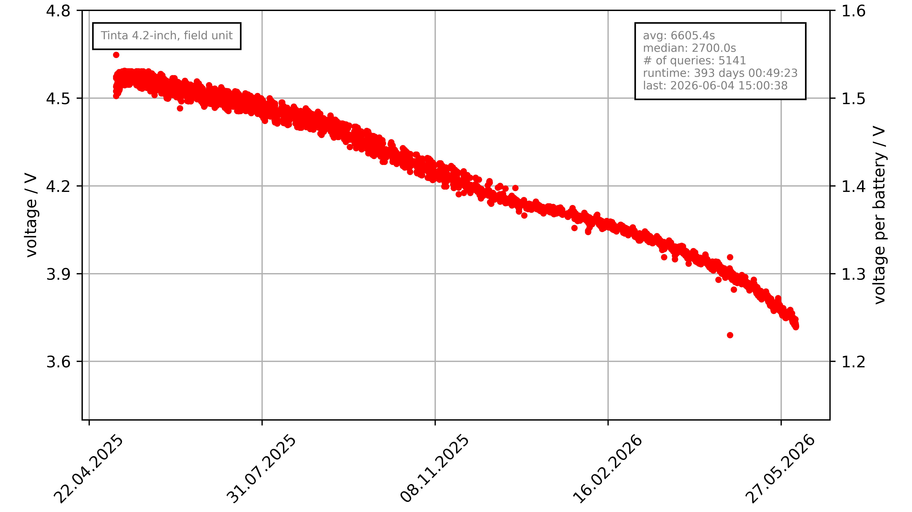

# Tinta Circuit

This directory contains the schematic and hardware documentation for the **Tinta** PCB. There is also a former hand-solderable design, see [`legacy/`](legacy/).

---

## Overview

The Tinta circuit is designed for long-term operation (years) using 3×AAA or 3×AA
batteries. It uses a real-time clock for accurate timekeeping and wake-up scheduling —
either a DS3231 or RV-3028, detected automatically at runtime — combined with
MOSFET-based power switching to fully disconnect the controller between wake cycles.
During wake cycles, information is fetched via Wi-Fi and displayed on an ePaper display
that retains its content without power.

Key features:
- **MOSFET power switching** — Pico W fully disconnected during sleep, drawing only µA from the RTC and passives
- **Dual RTC support** — DS3231 or RV-3028, auto-detected at runtime via I2C
- **NFC wake and control** — ST25 chip powered by RF field when Pico is off
- **Board identity straps** — 4-bit hardware profile (GP0–GP3) selects display type and hardware variant at boot
- **Push button inputs** — manual wake, page selection, and on-demand fetches

---

## Concept, Functional Blocks and Components

The power control concept works as follows: in the default (sleep) state **Q1** is off
and the Pico W has no supply voltage. Three sources can wake the system: an RTC alarm
(DS3231 or RV-3028 via their INT pin), a **pushbutton**, or an NFC field event from the
ST25DV. Once Q1 switches on, the Pico pulls down the gate of **Q2**
to hold power, executes its program, sets the next RTC alarm, and cuts power by releasing
Q1 — returning to the µA idle state.

The ePaper display is controlled via SPI; RTC and NFC communicate via I2C.

Manual user interaction:
- **Pushbuttons #0–3**: on current boards the buttons are diode-OR'd into the wake line,
  so **any of the four wakes the device**. On earlier boards only #0 wakes it.
- **Pushbuttons #1–3**: also read once at startup to select the page — hold them while the
  device powers on. Page selection works the same on both board generations.
- **ST25 NFC**: write an NFC message to the tag to trigger a wake or page selection

<table>
<tr>
  <td style="padding: 20px;"></td>
  <td style="padding: 20px;"></td>
</tr>
<tr>
  <td align="center" style="padding: 20px;"><em>Tinta board – for details use KiCAD</em></td>
  <td align="center" style="padding: 20px;"><em>schematic – <a href="inki_l2.pdf">PDF</a> · for details use KiCAD</em></td>
</tr>
</table>

---

## Board Identity Straps (R8–R11)

Four 10k pull-up resistors on GP0–GP3 encode the board profile as a 4-bit code read at
boot to determine display type and hardware configuration.

- **Populated resistor** = bit reads `1`
- **Empty pad** = bit reads `0` (firmware applies internal pull-down)

| Code | R8  | R9  | R10 | R11 | Display | Coin Cell | Board                     |
|------|-----|-----|-----|-----|---------|-----------|---------------------------|
| 0x00 | —   | —   | —   | —   | ?       | yes       | Legacy / unstrapped       |
| 0x01 | 10k | —   | —   | —   | 7.5"    | yes       | L1, 7.5"                  |
| 0x02 | —   | 10k | —   | —   | 4.2"    | yes       | L1, 4.2"                  |
| 0x03 | 10k | 10k | —   | —   | 7.5"    | yes       | L2, 7.5"                  |
| 0x04 | —   | —   | 10k | —   | 4.2"    | yes       | L2, 4.2"                  |
| 0x05 | 10k | —   | 10k | —   | 7.5"    | no        | L2 minimal (no coin cell) |
| 0x06 | —   | 10k | 10k | —   | 4.2"    | no        | L2 minimal 4.2" (no coin cell) |
| 0x07–0x0F | — | — | — | — | —      | —         | (reserved)                |

I2C devices (RTC, NFC) are auto-detected via bus scan — not encoded in straps. Buttons
and LED do not require strap encoding.

---

## RTC Backend Selection

The firmware auto-detects the RTC at runtime via I2C bus scan:
- **DS3231** at 0x68 — classic, high-accuracy, moderate power (~200 µA active)
- **RV-3028** at 0x52 — ultra-low power (~45 nA idle), AMBA/Micro Crystal

Both provide alarm-based wake scheduling. The RV-3028 improves idle power budget
significantly for high-frequency refresh use cases.

---

## NFC Integration (ST25DV04KC)

The ST25DV NFC tag is powered from the RF field when the Pico is off (0 mA from battery).
Its GPIO-controlled VCC line (GP18) is held low during sleep. An NFC write from a phone
or reader pulls the ST25 INT line, which feeds into the wake circuit — waking the device
without a button press. The firmware reads the NFC payload at startup to determine the
requested page or action.

---

## Power Consumption and Estimations

Typical battery life can be estimated with
[`power_consumption_estimate.py`](power_consumption_estimate.py). Edit the parameters at the top
of the script and run it; the two examples below are its output.

### Power Consumption Estimate for 4.2"

Parameters taken from a real deployment — the field unit whose discharge curve is shown below.

**Used Parameters**

- **Idle current**: 5 µA (RTC consumption, residual current via pullups and others)
- **Activation consumption**: 0.250 mAh per wake-up (same for 4.2" and 7.5", measured — the
  ePaper refresh is not a significant contribution)
- **LED consumption** (included above): 0.021 mAh per wake-up
- **Wake-up schedule**: 18.3× per day, 5 days per week
- **Battery self-discharge**: 2.5 % per year
- **Battery capacity**: 1200 mAh (AAA batteries)

**Annualized Consumption Rates (approximate)**

- **Idle**: 43.8 mAh/year
- **Active (wake-ups)**: 1192.8 mAh/year

**⇒ Estimated battery lifetime: 350 days (≈ 0.96 years)**

**Yearly Breakdown**

| Year | Self-Discharge (mAh) | Fixed Consumption (mAh) |
|------|----------------------|--------------------------|
| 1    | 14.32                | 1185.75                  |

  

<i>The same unit, measured: 393 days and 5142 wake cycles on one set of AAA
cells, logged at every wake. The scheduled interval held a median of exactly 2700.0 s, in each of
the 13 months, with a p95 jitter of about 7 s that did not change as the pack drained; the
discharge fits a straight line at R² = 0.987. One interruption occurred in the whole period,
66 hours in January 2026, appearing at the same time in the logs of five other units on the same
server.</i>

---

### Power Consumption Estimate for 7.5"

**Used Parameters**

- **Idle current**: 5 µA (RTC consumption, residual current via pullups and others)
- **Activation consumption**: 0.250 mAh per wake-up (same for 4.2" and 7.5", measured — the
  ePaper refresh is not a significant contribution)
- **LED consumption** (included above): 0.021 mAh per wake-up
- **Wake-up schedule**: 12× per day, 5 days per week
- **Battery self-discharge**: 2.5 % per year
- **Battery capacity**: 2500 mAh (AA batteries)

**Annualized Consumption Rates (approximate)**

- **Idle**: 43.8 mAh/year
- **Active (wake-ups)**: 782.1 mAh/year

**⇒ Estimated battery lifetime: 1065 days (≈ 2.92 years)**

**Yearly Breakdown**

| Year | Self-Discharge (mAh) | Fixed Consumption (mAh) |
|------|----------------------|--------------------------|
| 1    | 51.48                | 826.80                   |
| 2    | 29.82                | 826.80                   |
| 3    | 8.76                 | 757.20                   |

---

## RTC Backup Supply

Some boards carry a coin cell (**BT1**, e.g. CR1225) feeding the RTC's VBAT pin through a
diode-OR (**D1**, **D2**) alongside the main battery. It is optional and no longer fitted:
Tinta re-syncs the RTC from the network at every wake cycle, so the RTC only has to hold time
between cycles, which the main cells do. The board identity straps record which variant a given
board is.

---

## Key Components

- **Q1**: P-channel MOSFET — main power switch, disconnects Pico during sleep
- **Q2**: N-channel MOSFET — power latch (Pico holds itself on)
- **U1**: Raspberry Pi Pico W — main controller (Wi-Fi, ePaper, I2C, SPI)
- **U2**: DS3231SN or RV-3028 — RTC, alarm wake, I2C (auto-detected)
- **U3**: ST25DV04KC — NFC tag, ISO 15693, I2C, RF-powered when Pico off
- **R8–R11**: Board identity straps (10k pull-ups on GP0–GP3)
- **D1/D2, BT1**: optional diode-OR and coin cell for RTC backup (not fitted on current boards)

---

## Files

- `inki_l2.pdf` — schematic PDF (no KiCad required)
- `inki_l2.kicad_sch` — main schematic
- `inki_l2.kicad_pcb` — PCB layout
- `inki_l2_BOM.csv` — bill of materials
- `wake_sources.kicad_sch` — wake circuit sub-schematic
- `optional_i2c_device.kicad_sch` — optional I2C device sub-schematic
- `power_consumption_estimate.py` — battery lifetime model (edit parameters, run)
- `project-libraries/` — custom KiCad symbols and footprints

---

## Legacy Design

A former hand-solderable design is preserved in [`legacy/`](legacy/). It supports DS3231
only and has no NFC or identity straps, but can be assembled by an experienced solderer
without SMD equipment.

---

## License

This hardware is published under the **CERN-OHL-S v2** license.
