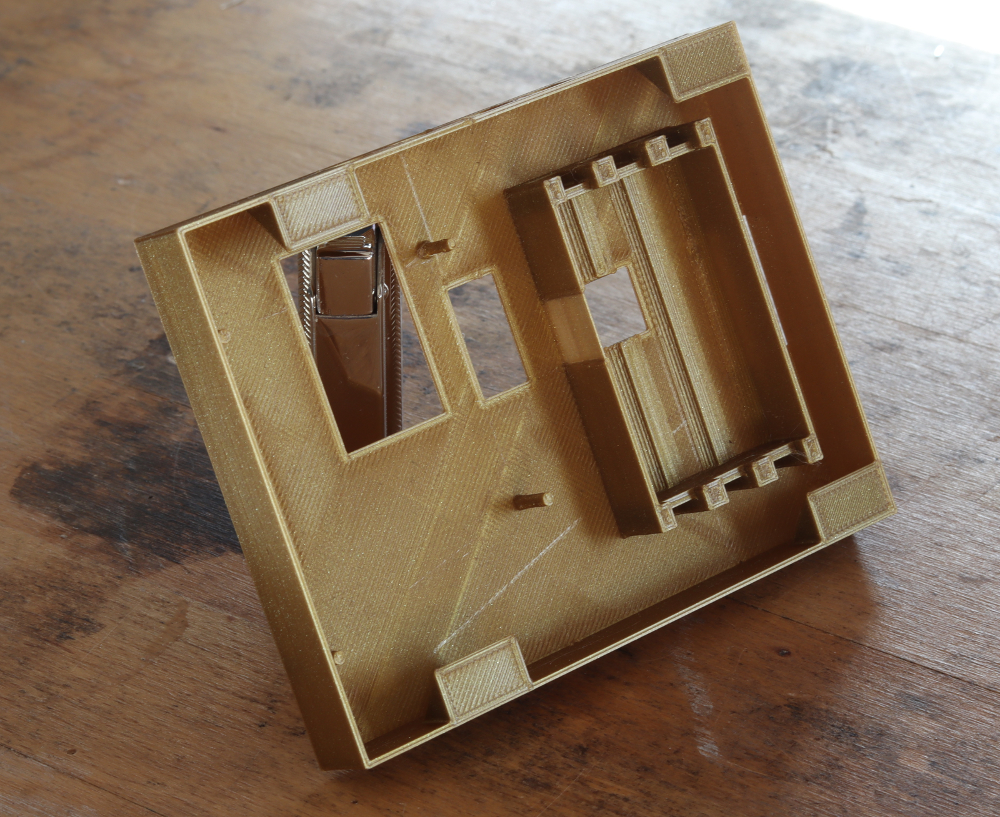
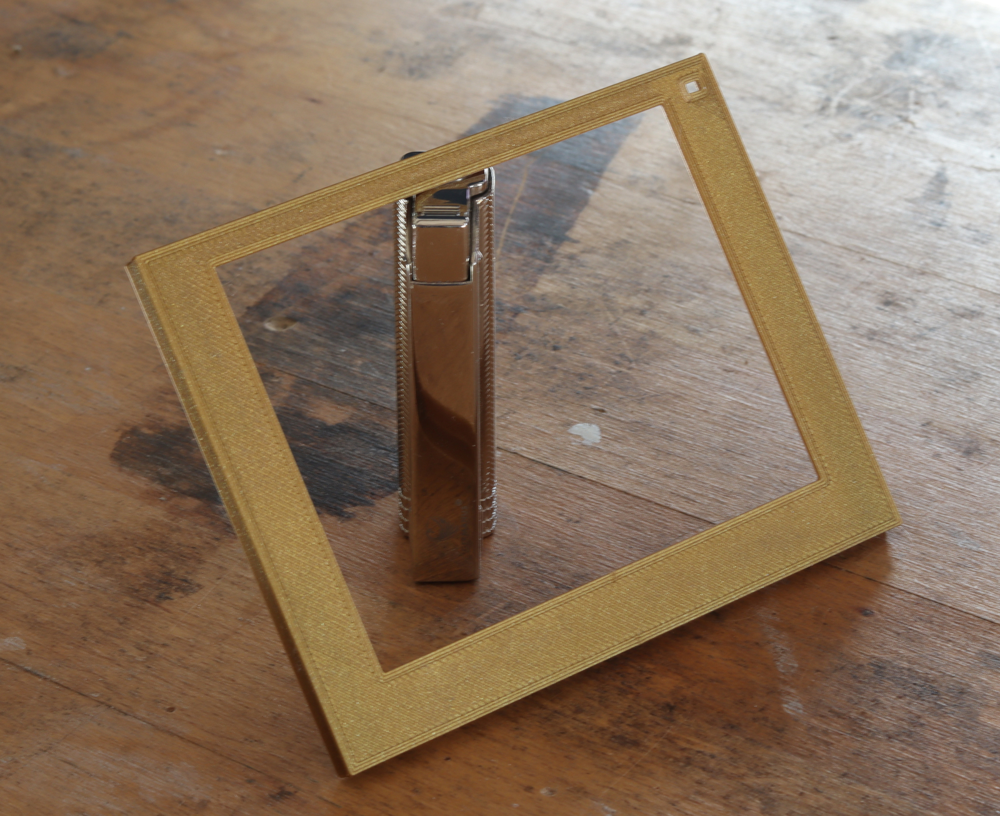

# eSign Enclosure

This directory contains the 3D-printable enclosures for the eSign project, created in FreeCAD. Two versions are included, supporting:

- **4.2" Waveshare V2 ePaper display**
- **7.5" Waveshare V2 ePaper display**

Both are tailored to fit the shared custom eSign PCB and for wall mounting.

---

## Assembly and Example Photos

### Assembly Animation (4.2" version)

This animation shows the step-by-step assembly of the 4.2" enclosure.

### Example Photos

**Parts 4.2" version:**

  
  

**Case and bezel 4.2" version:**

  
  

**Wallmount:**

  

Additional detail shots can be found in the `images/` folder.

---

## Notes

- The same PCB fits both enclosures.
- The LED and ePaper module are integrated into the bezel.
- The parts are assembled with (small amounts of) epoxy glue.

---
## Directory Structure

- `Case_frame_waveshare_4_2_epaper/` – STL + FCStd files for the 4.2" version
- `Case_frame_waveshare_7_5_epaper/` – STL + FCStd files for the 7.5" version

Each folder includes:
- Main body (`Case`)
- Bezel frame (`Bezel`)
- Wall mount
- FreeCAD source files (`.FCStd`)
- Mechanical reference files

---

## Print Info (applies to both)

- **Printer:** Creality Ender-3 (standard quality)
- **Material:** PLA
- **Layer height:** 0.2 mm
- **Infill:** ~40 % (non-critical)
- **Supports:** Not required
- **Assembly:** Bezel is glued to the case, PCB held by built-in printed pins

---

## License

These files are licensed under the **CERN Open Hardware License v2 - Strongly Reciprocal (CERN-OHL-S-2.0)**.  
See `../LICENSE` for full license text.
